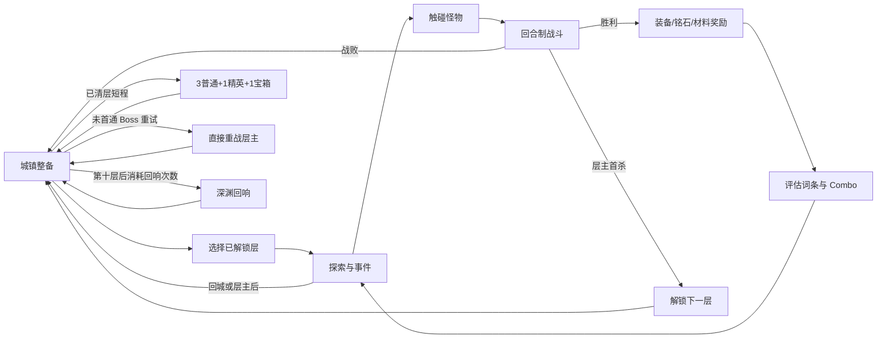
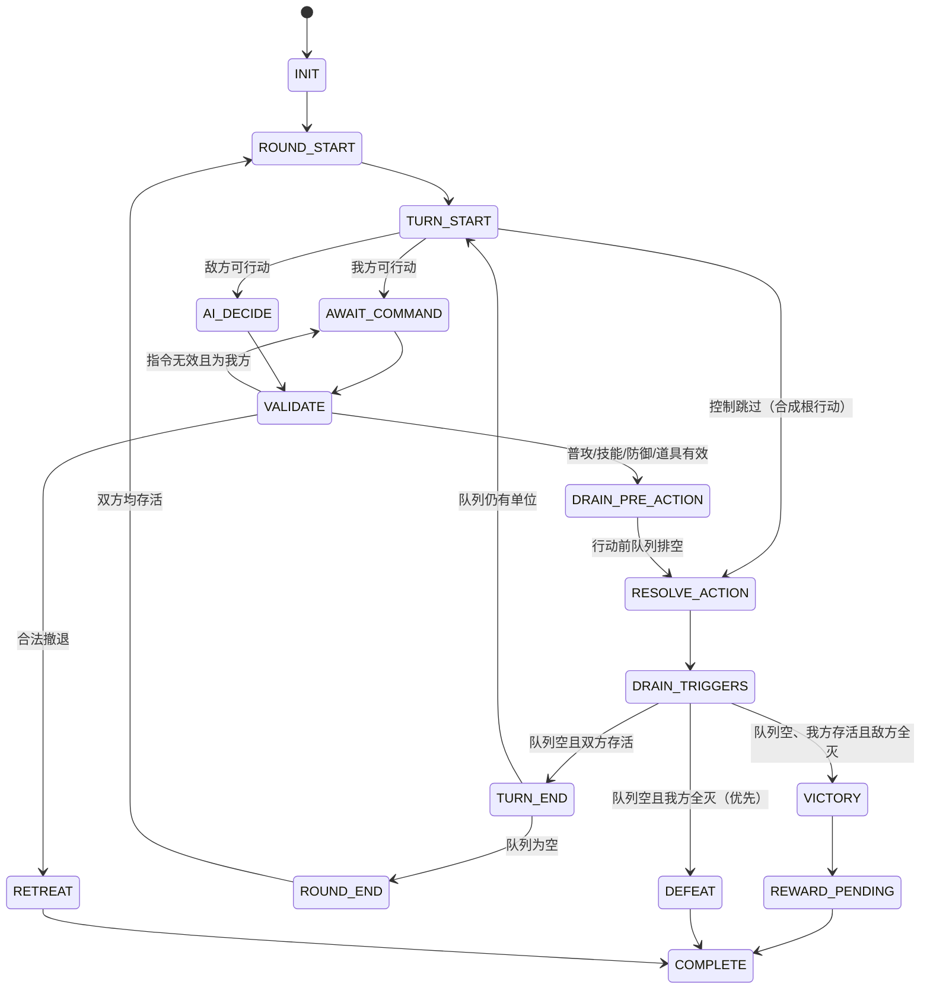

# 游戏设计规格

## 文档状态

- 版本：GAME-1.2
- 状态：CONFIRMED（随 REQ-1.2 冻结）
- 规范性：玩法时序、结算公式与边界规则均为首版实现输入；数值表以对应 `*-1.2-draft` 冻结表为真源

## 1. 定位与设计支柱

- 项目代号：《词链深渊》。正式名称可替换，不进入代码常量。
- 类型：单机、像素风、队伍构筑、刷宝、俯视角探索、回合制 RPG。
- 主要平台：移动端 H5 横屏。
- 自用验证的参考节奏：短程约 8～12 分钟、完整远征约 18～25 分钟、普通战约 30～90 秒、Boss/回响战约 2～5 分钟；只用于发现明显拖沓，不作为群体 P50/P90 硬门禁。
- 设计支柱：掉落要能改变打法、构筑结果可解释、失败不摧毁积累、手机上随时可暂停恢复。

## 2. 核心循环



远征开始时由注入的 `SeedFactory.nextUint32()` 生成并立即保存 `expeditionSeed`；生产 SeedFactory 只调用 `crypto.getRandomValues`，测试使用固定实现，禁止 `Math.random()`。以该 seed 初始化根 RNG 后，namespace 必须使用下列精确 UTF-8 字符串且 derive 不推进根流：

- 地图怪物游荡：`encounter:<mapId>:<encounterObjectId>`。
- 接触战斗：`battle:<mapId>:<encounterObjectId>`；初始四元状态写入 BattleSnapshot，之后只读取快照状态。
- 战斗奖励：`loot:<mapId>:<encounterObjectId>`；同一对象胜利只结算一次。
- 宝箱：`chest:<mapId>:<chestObjectId>`。
- 新远征商店刷新：`shop`。
- 新游戏初始商店使用同一事务注入的独立 `newGameSeed` 根流和 `shop` namespace；offers 写入后无需保存该临时 seed。

野外怪物当前位置和游荡 RNG 不进入存档；离开探索场景即销毁该运行态，重载地图或战斗返回时，未击败对象都回到冻结锚点并从自身 encounter namespace 重新开始。玩家位置、安全位置、已击败/已开启对象仍按 ExpeditionSnapshot 恢复。内容遭遇编组本身是固定表，不使用随机流。

深渊回响的本次编号固定为 `attemptNumber=旧存档.echoAttemptSequence+1`；开始事务在扣除次数、创建远征/战斗的同一提交中把 `echoAttemptSequence` 写为该编号。根 namespace 固定为 `echo:<echoId>:attempt:<attemptNumber>`，并从根流分别派生 `battle` 与 `loot` 子流；战斗行动次数、动画跳过或目标选择绝不能推进 loot 子流。开始事务保存失败时编号不增长；同一次待提交/终局重试复用原 attemptNumber、子流状态、奖励与事务 ID，不重新生成。下一次成功开始必须使用更大的 attemptNumber。Boss 重试继续使用该次重试新生成的 expeditionSeed 与原地图 Boss objectId，禁止复用战败战斗的 RNG 快照。

## 3. 地图与远征

### 3.1 地图单位

- 地图格：`16 × 16` 逻辑像素。
- 城镇固定尺寸：`80 × 60` 格。
- 十张野外地图固定尺寸：`96 × 64` 格；首版不允许单层覆盖。
- 角色脚底碰撞盒：宽 12、高 8，锚点位于角色脚底中心。
- 基础速度：72 像素/秒；对角输入归一化，不能比水平移动更快。
- 碰撞采用 X/Y 分轴求解，先处理绝对位移较大的轴；每个固定步最多移动 4 像素，避免低帧率穿透。

### 3.2 相机

- 相机使用 `96 × 54` 逻辑像素死区。
- 玩家离开死区后相机跟随；最终世界根节点坐标取整，避免像素纹理抖动。
- 相机不能显示地图边界之外；小于视口的地图居中。
- 战斗触发前记录最近一个无碰撞安全位置，而不是直接记录碰撞瞬间位置。

### 3.3 遭遇状态

```text
IDLE -> PATROL/WANDER -> ALERT -> CHASE -> CONTACT_LOCKED
                     ^                  |
                     |---- LEASH -------|
```

- `IDLE`：等待初始延迟。
- `PATROL`：沿配置路径往返。
- `WANDER`：在出生半径内选择可达点。
- `ALERT`：发现玩家后 300ms 预警，不立刻触发碰撞。
- `CHASE`：追击到脱战半径或发生接触。
- `CONTACT_LOCKED`：已开始转场，禁止重复派发事件。
- 战斗返回后的 3 秒保护只屏蔽接触，不冻结怪物 AI。
- 保护期以 `encounterProtectionStepsRemaining = 180` 写入远征快照；固定步递减，重载不能清除保护。

首版探索规则进一步冻结如下，避免移动与遇敌在实现时出现两套解释：

- 玩家与遭遇对象都使用脚底中心为锚点的 `12×8` AABB。遭遇对象是触发体，不阻挡玩家，也彼此忽略；它们只与地图 collision 和 blocking NPC 做与玩家相同的分轴碰撞。每步移动先走绝对位移较大的轴，同值固定 X 后 Y；第一轴受阻后仍尝试第二轴，不做寻路、视线检测或绕路推断。
- 距离判断统一使用脚底锚点的欧氏距离平方，不开平方。`detectionRadius` 以怪物当前位置为圆心，`leashRadius` 以冻结出生锚点为圆心；遮挡物不阻断发现。Boss 的 detection/leash 都为 0，因此只在 AABB 主动接触时触发。
- 所有未击败对象建立后先进入 30 个固定步的 IDLE。patrol 按 `patrolPoints` 原数组往返，距端点不足本步位移时精确吸附并换向；wander 从出生半径内“中心 tile 可站立且 12×8 AABB 无碰撞”的候选 tile 按 row-major 建表并稳定等权抽一个目标（一个候选也消费），到达后等待 60 步再抽下一点；stationary 保持出生点。任何行为都只用自己的 encounter 子流。
- 玩家进入 detectionRadius 后进入 ALERT 并原地预警 18 个固定步；18 步内离开检测半径则回到原行为且进度清零。预警完成进入 CHASE，以 moveSpeed 朝玩家脚底锚点直线移动。怪物脚底离出生锚点超过 leashRadius 时立即进入 LEASH，按同一碰撞规则直线返回；回到距出生点 1 像素内吸附到出生点、进入 30 步 IDLE。追击中不因玩家暂时离开 detectionRadius 直接放弃。
- 每个固定步的顺序固定为：读取并应用玩家输入 → 更新全部遭遇（按 MapDefinition.objects 原数组顺序）→ 以“本步开始时保护值是否大于 0”判断是否屏蔽接触 → 若无接触锁定且玩家当前未与任何遭遇 AABB 重叠，更新 safePosition → 若本步开始受保护则把保护值减 1。这样正好保护 180 个完整固定步，第 181 步才可触发；同一步多只怪重叠时只选择 objectId UTF-16 升序第一项并把本图探索态锁为 CONTACT_LOCKED。
- 初始/新建远征的 playerPosition 与 safePosition 都等于 MapDefinition.spawnPoint。接触发生时不再更新 safePosition；战斗胜利、撤退分别回到该点并写入 180，战败结束远征。页面隐藏或地图转场保存时，defeated/opened 数组按 MapDefinition.objects 原顺序保存且不得重复。
- NPC、宝箱和 portal 的 `position` 同样是交互锚点；最近交互以玩家脚底锚点到对象锚点的距离平方计算。NPC 的 blocking AABB 为 `12×8`；宝箱和 portal 不阻挡。交互按钮只处理 28 像素内未开启宝箱、NPC 和 portal；遭遇只走 AABB 接触，不进入交互候选。

### 3.4 三种远征模式

| mode | 进入条件 | 运行内容 | 结束与奖励 |
| --- | --- | --- | --- |
| `exploration` | 楼层已解锁；未首通层唯一可选 | 地图全部 8 普通、2 精英、3 宝箱、Boss 和回城门 | 可回城；Boss 正常掉落/首通；F6～10 Boss 胜利额外获得 1 回响次数 |
| `shortFarm` | 楼层 Boss 已首通 | 只物化 `obj_fNN_n01/n02/n03/e01/chest01/return`；其他对象不创建 | 3 普通、1 精英、1 宝箱清完后显示完成 CTA；无 Boss、首通或回响次数 |
| `bossRetry` | 普通远征已经接触且尚未首通该层 Boss | 不 attach MapScene，直接用该层 Boss encounter 创建战斗 | 正常 Boss 与首通奖励；胜败后统一回城；首通后入口隐藏 |

- `shortFarm` 与 `exploration` 各自创建新的 expeditionId/seed，并在同一事务刷新商店；短程不是完整远征的中途切换，开始后不能改变 mode。`bossRetry/abyssEcho` 不刷新商店，进入、战败、胜利、保存失败或重载均保持 `shop.stockRevision/offers/generatedFromExpeditionId` 逐字节不变。
- 普通 `exploration` 首次成功创建未首通 Boss 战时，在同一存档事务把 floorId 追加到 `bossRetryUnlockedFloorIds`。资源或保存失败时不解锁；进入战斗后主动刷新、战败或系统中断都不撤销。
- `bossRetry` 的遭遇对象使用该地图冻结的 `obj_fNN_boss` 身份以复用严格引用，但探索对象列表为空、返回点不用于 attach。胜利时不得把其计为完整深渊远征，故不增加回响次数。
- 完整/短程时长以“点击开始远征成功 → 回到城镇可操作”为口径；后台、竖屏暂停和用户停留在说明弹窗的时间从交互时长指标排除，但战斗模拟轮数不排除。

## 4. 角色、编队与成长

### 4.1 完整首版角色

| ID | zh-CN 名称 | role | allowedWeaponTypes | 本源标签 | 核心玩法 |
| --- | --- | --- | --- | --- | --- |
| `char_wanderer` | 流浪剑士 | fighter | `[sword]` | `bleed ×1`, `guard ×1` | 裂伤、格挡、处决 |
| `char_iron_guard` | 铁卫 | tank | `[hammer]` | `shield ×1`, `taunt ×1` | 护盾、嘲讽、反击 |
| `char_ranger` | 游侠 | ranger | `[bow]` | `speed ×1`, `chase ×1` | 暴击、协击、追击 |
| `char_ember_mage` | 炎术师 | mage | `[staff]` | `burn ×1`, `detonate ×1` | 灼烧叠层、范围引爆 |
| `char_frost_seer` | 冰霜先知 | mage | `[focus]` | `frost ×1`, `control ×1` | 减速、冻结、传播 |
| `char_priest` | 祭司 | support | `[relic]` | `heal ×1`, `shield ×1` | 治疗、净化、过量护盾 |

垂直切片使用 `char_wanderer`、`char_iron_guard`、`char_ember_mage`、`char_priest`，保证首批流血、反击、灼烧和圣愈四个 Combo 都有可达构筑。

### 4.2 等级和属性

- 等级范围：1～50。
- 下一级经验：`100 + 60 × (当前等级 - 1)`。
- `CharacterProgressV1.xp` 保存从 1 级开始累计获得的总经验，而非本级经验；等级由累计阈值唯一反算。50 级时 xp 钳制为 `75460`，超出经验丢弃。
- 本场开战时位于四个队伍槽中的角色（包括结算时倒地者）获得遭遇配置的全部经验；未出战但已招募角色获得向下取整的 50%；未招募角色获得 0。
- 最终基础属性：`floor((角色基础值 + 每级成长 × (等级 - 1) + 所有 flat) × (10000 + percentBps) / 10000)`。
- `maxHp`、`attack`、`defense`、`speed` 最小为 1。
- `critRateBps` 范围 0～10000；角色和敌人的基础值必须由冻结表明确给出，不能使用运行时默认值。
- `critDamageBps` 范围 10000～30000；首版角色与敌人冻结值均为 15000，但仍须逐条写入内容。
- `effectHitBps`、`effectResistBps` 范围 0～10000。
- 所有百分比用 basis point 表示，`10000 = 100%`；领域层不保存浮点数。
- 入战 baseline 只固化等级成长、被动、装备基础与无条件词条，并同时保存 `prePercentStats`、`staticPercentByStatBps` 和可核对的 `stats`。HP 条件、目标条件、阵型条件和 status modifier 在每次取有效属性/伤害加成时按 `data-contracts.md` 第 13 节的同区加算公式计算；ROUND_START 的速度快照也走该解析器。禁止从最终 `stats` 再乘动态百分比，或把动态值永久写回三个静态快照字段。
- 所有 HP 门槛都用当前 `currentHp` 与“忽略 HP 条件词条、但计入其他当前动态状态”的有效 maxHp 做整数交叉相乘：AtMost 当 `currentHp×10000 <= effectiveMaxHpWithoutHpConditions×thresholdBps`，AtLeast 使用 `>=`。这样 HP 条件修饰 maxHp 时不会自引用震荡；目标门槛同理读取目标。倒地单位比例为 0，但要求存活的候选仍先被来源/目标存活校验拒绝。
- 角色升级时先计算旧/新无动态 maxHp；若旧 currentHp>0，则 `currentHp=min(newMaxHp,oldCurrentHp+max(0,newMaxHp-oldMaxHp))`，即只补本次等级成长带来的生命上限增量；旧 currentHp=0 时保持 0。城镇换装/卸装导致 maxHp 变化时不治疗也不按比例换算，固定为 `currentHp=min(oldCurrentHp,newMaxHp)`。
- 胜利奖励先把出战角色的战后 HP 写回 CharacterProgress，其中倒地者固定先复苏为 1，再分配 XP/升级并按上一条为这次升级补最大生命增量；因此胜利后的倒地者不会保持 0。撤退只写回战后 HP且无 XP，倒地者保持 0；战败无奖励，结束远征后把全部 recruited 角色写为 `max(1,floor(currentMaxHp×5000/10000))`。旅店把全部 recruited 角色写为当前满生命。以上均在各自单一存档事务中完成，未招募记录不被旅店/战败修改。

### 4.3 阵型

| 槽位 | 阵营内位置 | 规则 |
| --- | --- | --- |
| 0 | 前排上 | 单体近战优先可选 |
| 1 | 前排下 | 单体近战优先可选 |
| 2 | 后排上 | 前排存活时不可被普通近战直接选择 |
| 3 | 后排下 | 前排存活时不可被普通近战直接选择 |

敌方可使用槽位 0～5，其中 0～2 为前排，3～5 为后排。技能通过独立字段 `requiresFrontAccess` 声明是否受前排阻挡；`targetRule` 只声明目标集合，两者不能互相推断。

### 4.4 五名队友招募冻结表

主角没有 RecruitmentDefinition；其余角色恰好一条。`gold` 条件的 `minimumClearedFloor=0` 明确表示无需首通任何层，goldCost=0 的提交仍走一次幂等招募事务但不扣金币。

| recruitmentId | characterId | condition | 玩家展示 |
| --- | --- | --- | --- |
| `recruit_iron_guard_tavern` | `char_iron_guard` | `{kind:'gold',goldCost:0,minimumClearedFloor:0}` | 酒馆初始免费加入 |
| `recruit_ember_mage_tavern` | `char_ember_mage` | `{kind:'gold',goldCost:0,minimumClearedFloor:0}` | 酒馆初始免费加入 |
| `recruit_priest_first_elite` | `char_priest` | `{kind:'questCompleted',questId:'quest_first_elite'}` | 击败第一层精英后加入 |
| `recruit_ranger_floor_02` | `char_ranger` | `{kind:'firstClear',floorNumber:2}` | 第二层首通后加入 |
| `recruit_frost_floor_04` | `char_frost_seer` | `{kind:'firstClear',floorNumber:4}` | 第四层首通后加入 |

唯一配套任务为 `quest_first_elite`：unlockCondition=`always`，completionCondition=`encounterCleared:encounter_floor_01_elite_boar`。完成条件在精英胜利奖励事务内写入 `completedQuestIds`，与遭遇移除同时成功或同时失败；重复结算不重复招募。

所有条件只控制酒馆招募项是否可提交，不自动把角色写入队伍；玩家在酒馆点击“招募”并确认后才设置 `recruited=true`。已招募角色再次提交返回 `CHARACTER_ALREADY_RECRUITED`，状态与 revision 不变。

确认招募与金币扣除在同一存档事务中执行。新角色固定写入：`level=主角当前 level`、`xp=该等级累计经验下限`、`skillPoints=level-1`、`currentHp=该角色在空装备且计入固定被动时的当前等级 maxHp`、四个主动技能等级全 0、两个主动槽全空、六装备槽和铭石槽全空。追赶不授予主角已获得的额外经验，不复制任何装备或技能配置，也不自动进入队伍。

## 5. 战斗状态机



### 5.1 稳定快照点

- `AWAIT_COMMAND`。
- 任一根行动及其触发队列完整结算后的下一个 `TURN_START`。
- `REWARD_PENDING`，但奖励事务尚未提交。
- `COMPLETE`。

动画帧、伤害数字中间态和触发队列处理中不形成存档。

### 5.2 行动顺序

1. `ROUND_START` 计算有效速度快照。
2. 按速度降序；同速我方先；同阵营按槽位升序。
3. 速度增减只写实时属性，不修改本轮队列。
4. 行动前再次检查存活和控制状态。
5. 死亡立即从剩余队列过滤。
6. 额外行动在当前根行动全部触发结束且终局检查仍为 ongoing 后，插到尚未执行队列的最前端；多个成功 grant 按其 `EXTRA_TURN_RESOLVED` 事件顺序保持 FIFO，不能连续 unshift 造成逆序。每单位每轮最多一次，目标已死亡、已用过额外行动或战斗已结束时输出 suppressed 且不入队；尚未执行正常回合的单位获得额外行动后，原正常回合仍保留。

### 5.3 指令与资源

| 指令 | 消耗 | 能量变化 | 其他规则 |
| --- | --- | --- | --- |
| 普通攻击 | 当前回合 | +25 | 受普攻机制词条影响 |
| 主动技能 | 当前回合、对应冷却 | +10 | 使用后进入未来 N 个本人回合冷却 |
| 终极技能 | 当前回合、100 能量 | 重置为 0 | 能量不足禁用 |
| 防御 | 当前回合 | +15 | 直接伤害 -30%，到下次本人回合开始 |
| 道具 | 当前回合、一个物品 | 0 | 提交行动时扣除，失败整体回滚 |
| 撤退 | 结束战斗 | 0 | 仅普通/精英战 |

同一个敌方根行动无论多段命中多少次，每个受击单位最多获得一次 `+10` 受击能量。

冷却计数避免歧义：技能使用成功时先计算 `N=max(0,baseCooldown+全部显式修正)`，向 `cooldowns[skillId]` 写入 `N+1`；每个单位自己的 `TURN_END` 将其所有正冷却各减 1。因此 UI 在随后第一个本人回合看到 N，且严格有未来 N 个本人回合不可使用；N=0 的技能在当前 TURN_END 后回到 0。`CooldownEffectSpec` 修改当前存储计数并钳制到 0，但不能取消本次指令已经消耗的回合。

### 5.4 根行动与领域事件顺序

合法 basic/active/ultimate/defend/item 命令固定按下列顺序结算，括号内没有内容时不产生伪事件：

1. 校验全部通过后才分配 rootActionId、令 battleRevision 预备递增并输出 `ACTION_STARTED`；此前失败不消费 RNG、物品、能量或 ID。
2. 原子写入指令成本：ultimate 能量归零、技能冷却写入、item 声明预扣 1 个；数值变化按发生顺序输出 `RESOURCE_CHANGED(reason='actionCost')`，背包扣除不伪装成战斗资源事件。纯 ActionResolver 通过 `BattleResolutionV1.consumedItem` 返回预扣声明，SaveCoordinator 将它与最终 BattleSnapshot 在同一 GameSave revision 事务提交；提交前不得播放事件或改写权威 GameStore。保存失败时权威 Store 保持旧快照、丢弃 events，并保留不可变 command/candidate（或从旧 snapshot 与旧 RNG 确定性重算）供原样重试；不得在脏内存状态上继续结算。后续任一步失败同样回滚，绝不先扣物品。
3. 收集一次 beforeAction 候选并进入 `DRAIN_PRE_ACTION`，把此时已经入队的派生效果及其连锁严格 FIFO 排空；完成后才开始根 effects。因此“三相共鸣”的攻击提升会作用于触发它的当前根行动，不能延迟到这一击之后。content-1.2.0 的 beforeAction 来源恰好只有 `combo_swift_formation` 与 `combo_triune_elements`，且 effects 只能是本表冻结的无伤害 buff；内容校验禁止表外 beforeAction 定义，故该阶段不会提前造成终局。
4. 按原数组应用根 effects。DEFEND 的唯一根 effect 固定展开为 `{kind:'applyStatus',targetRule:'self',statusId:'status_guard_30',baseChanceBps:10000,stacks:1,durationOwnerTurns:1}`，effectIndex=0；它不读取内容表外的隐藏技能。
5. 根 effects 完成后写入技能/防御的最终基础能量增量：basic +25、active +10、defend +15、ultimate 先归零后只获得明确技能词条增量、item +0；输出 `RESOURCE_CHANGED(reason='actionGain')`。EffectSpec/词条直接修改能量时才用 reason=effect。随后依次收集 afterRootAction、符合条件的 bleed 周期事件，再进入 `DRAIN_TRIGGERS`。
6. FIFO 排空后判定双方存活与额外行动，输出 `ACTION_FINISHED(outcomeAfter)`；若终局，再输出唯一 `BATTLE_FINISHED`，victory 紧接唯一 `REWARD_PREPARED`。所有这些事件仍携带该 rootActionId；成功结算最终只递增一次 battleRevision。

RETREAT 校验成功后仍分配根 ID，固定只输出 `ACTION_STARTED(actionKind='retreat') → ACTION_FINISHED(outcomeAfter='retreat') → BATTLE_FINISHED(outcome='retreat')`（`PHASE_CHANGED` 可按状态转换穿插且永远无根）；不产生 beforeAction/afterRootAction、能量、冷却、状态、掉落或奖励事件，不消费 RNG，并返回入战前安全点。Boss 撤退在校验阶段失败，因此一个事件也不产生。

存活单位在 TURN_START 被 `skipTurn` 控制时，按 RuntimeStatusStack 创建顺序选择第一条控制状态用于提示，并建立 `rootActionDefinitionId='action_skip_control'` 的合成根行动：输出 `ACTION_STARTED(actionKind='skip')`、`TURN_SKIPPED(reason='control')`，不产生 beforeAction/afterRootAction/bleed，不获得能量；仍执行该单位完整 TURN_END 的 burn/poison、状态持续时间与冷却递减，再排空由这些周期效果形成的 FIFO，最后按上条输出 ACTION_FINISHED/可能的终局事件并递增 battleRevision。队列中已死亡单位只输出无根的 `TURN_SKIPPED(reason='defeated')` 后移除，不执行 TURN_END，也不递增 revision。由此所有周期派生都拥有唯一 rootActionId，可复现预算和存档。

`TriggerSpec.requiredSkillKinds` 只读取当前事件的 `contextSkillKind`：根 basic/active/ultimate 分别保留自身 kind，`replaceBasicSkill` 仍算 basic，铭石调用的 effect Skill 算 effect；defend/item/retreat/skip、状态周期及纯内联派生为 null。派生效果不得仅因沿用 rootActionId 而冒充根技能 kind。

### 5.5 Boss 意图时序

Boss 的普通 AI 先按 DATA-1.2 选出 rule；只有胜出 skillId 命中唯一 `BossIntentDefinition` 且该 Boss 当前没有待释放意图时，才把本次技能执行替换为“声明意图”根行动：

1. 分配 rootActionId，输出 `ACTION_STARTED(actionKind='intent')`；rootActionDefinitionId 固定为 `action_declare_intent`，不执行技能 effects、不写 cooldown、不消费目标 RNG。
2. 保存 `{sourceUnitId,skillId,targetStrategy,declaredRound}` 并输出 `INTENT_DECLARED`。targetStrategy 被锁定，具体 unitId 不锁定，避免目标死亡后猜测替代。
3. 输出 `ACTION_FINISHED(outcomeAfter='ongoing')`，照常执行该 Boss 的 TURN_END、冷却递减和 battleRevision+1。
4. 该 Boss 下次进入可行动的 `AI_DECIDE` 时，优先级固定为：已达到条件且尚未施放的通用狂暴 → 待释放意图 → 常规 AI。狂暴先施放时 pending intent 原样保留；眩晕/冻结走 `action_skip_control`，同样不清除。
5. 释放意图时按保存的 targetStrategy 与技能 targetRule 对当前存活合法目标重新解析，执行真实 skillId 根行动并在此时写入技能冷却。战斗已经终局或 Boss 死亡时清除意图且不输出伪伤害；只要对手仍存活，10 条冻结意图都必须至少有一个合法目标，否则为 `INVALID_CONTENT`。

阶段阈值由 FloorDefinition 的 `bossPhaseThresholdBps` 提前显示。F1～F9 恰好 `[5000]`，F10 恰好 `[7000,3500]`，并由内容校验与 Boss phase rule 的 selfHpAtMostBps 交叉核对。意图不改变狂暴回合数；它以“牺牲一次 Boss 行动换取高威胁技可读性”进入正式平衡模拟，不能只在动画层延迟。

### 5.6 重复指令辅助

- 开启条件严格为 `expedition.mode in {'exploration','shortFarm'}`、当前 floor Boss 已首通且 EncounterDefinition.kind 为 normal/elite。其他场景不显示开关且不会排队自动命令。
- 每次进入玩家 `AWAIT_COMMAND` 后启动 350ms 可取消倒计时。期间任意 pointerdown、页面隐藏、方向变化、暂停或顶层弹窗都会取消；再次回到稳定输入点才重新决定。
- 记录值只能是 `basic` 或一个角色已装备 active skillId。手动或自动命令成功形成稳定快照后更新；失败、被控制跳过、终极、道具、防御和撤退不更新。
- active 仍已装备、已学习、冷却为 0 且资源/目标合法时提交；否则只尝试 basic。basic 也没有合法目标时停在手动输入，不猜测 defend/item。
- singleEnemy 从满足阵型规则的存活敌人中按 `currentHp/effectiveMaxHp` 升序选择，整数交叉相乘比较；singleAlly 同理选存活友方；deadAlly 按 slot/unitId 选倒地者；self/allAllies/allEnemies/randomEnemy 传空数组。所有同值固定 slot、unitId UTF-16 升序。
- UI 自动选择目标只生成普通 BattleCommandV1，领域层不接受 `AUTO_*` 旁路命令；同一 revision 的人工输入先到时取消自动提交，后到命令按正常 stale 错误拒绝。

## 6. 数值结算

### 6.1 直接伤害

所有步骤向下取整：

1. 技能词条 `addPowerBps` 先加到原始 power；随后按 `conditionalMultipliers` 原数组顺序，只对满足项执行 `effectivePowerBps=floor(effectivePowerBps×multiplierBps/10000)`。
2. `scaled = floor(attacker.attack × effectivePowerBps / 10000) + flatPower`。
3. `boosted = floor(max(0, scaled) × max(0,10000 + damageBonusBps) / 10000)`；所有适用 damageBonus 先加算成一个值。
4. 非 true 元素：`effectiveDefense = max(0, floor(target.defense × (10000 - ignoreDefenseBps) / 10000) - flatIgnoreDefense)`；true 元素固定为 0。
5. `defended = floor(boosted × 300 / (300 + effectiveDefense))`。
6. 非 true 元素倍率：弱点 12500、普通 10000、抗性 7500；`elemental=floor(defended×elementMultiplierBps/10000)`。同一 EnemyDefinition 禁止把同元素同时列入弱点与抗性。true 固定 10000。
7. 若本次暴击：`critical = floor(elemental × critDamageBps / 10000)`；否则不变。
8. 取确定性波动 `9500～10500`：`varied = floor(critical × varianceBps / 10000)`。
9. 若有 `finalDamageMultiplier`，按 stackRule 选出的唯一有效值执行 `finalBoosted=floor(varied×(10000+valueBps)/10000)`；没有则不变。
10. 将所有目标直接减伤相加为 `reductionBps=clamp(sum,0,9000)`；`reduced=floor(finalBoosted×(10000-reductionBps)/10000)`。防御指令的 3000 bps 包含在 sum 中。
11. `scaled>0` 且 `reduced=0` 时最终伤害最少为 1，否则最终伤害为 reduced；没有元素伤害免疫字段，状态 immunity 不影响直接伤害。
12. 先由护盾按创建时间从旧到新吸收，剩余值扣生命。

`DamageEffect.hitCount` 的固定循环顺序为 `hitIndex 0→N-1` 外层、该段目标按 faction 内 slot 升序内层。每个目标/每段都完整执行上述流程：`canCrit=true` 时先调用一次统一 `rollBps(critRateBps)`（0/10000 仍按公共无抽值规则），`canCrit=false` 不调用；随后无论伤害中间值是否为 0，都恰好调用一次 `nextIntInclusive(9500,10500)` 取得 variance。`allEnemies` 在每一段开始时重新取得当时存活合法目标，因此前段击倒者不进入后段。`randomEnemy` 默认首次抽定目标后所有段命中该目标；只有 `retargetEachHit=true` 才在每段开头按 slot 候选重新抽取，候选仅 1 个也调用一次 nextInt。每个实际造成至少 1 点护盾+生命伤害的目标/段产生一次 afterDirectHit；技能 effects 数组中的后续状态/治疗/护盾只执行一次，不随 hitCount 重复。

`damageBonusBps` 固定为：来源被动中 element 精确匹配或 all 的 damageBonus + 已装备同类普通词条 + 本次命中条件满足的 conditionalDamageBonus；各项先依 8.4 解析 effectiveRoll/stackRule，再全部同区相加。`all` 包含 true；具体元素只匹配自身。DamageCondition 与 AffixCondition 在每个目标/每段开始、任何本段扣血之前读取当下状态，按原数组/稳定来源顺序生成说明，但同一加算区数值结果与遍历次序无关。`finalDamageMultiplier` 再按 8.4 的 max 规则只取一项；当前王印位于单一 accessory 槽，但解析器不得靠槽位偶然性省略 max。

### 6.2 周期伤害

- `burn`、`poison` 的每一独立层在持有者 `TURN_END` 触发；`bleed` 的每一独立层在持有者完成一次含直接伤害的根行动后触发。被控制跳过的行动不触发 bleed。
- 每层使用施加瞬间写入的 `sourceAttackSnapshot`：`raw=floor(sourceAttackSnapshot×snapshotPowerBps/10000)`。
- 到触发时点即按上一条计算 raw，并依照 DATA-1.2 展开、固化单段运行时 DamageEffect 后入队；状态随后被驱散、到期或来源离场都不改变这条已经入队的快照事件。周期状态自身必须为 debuff，持有者就是固定 single target。
- 周期伤害不暴击、不抽 9500～10500 波动、不读取施加者当前属性、元素增伤、条件增伤或 finalDamageMultiplier；它读取目标触发时的有效 defense，并使用 `floor(raw×300/(300+effectiveDefense))`。
- 随后应用目标当下的元素弱点/抗性；不应用只写明“直接伤害”的防御与减伤。结果大于 0 时至少造成 1 点，仍由护盾按创建顺序吸收。
- 每层按 RuntimeStatusStack 创建顺序独立结算；某层来源已死亡不取消快照伤害。每层结算后都可触发死亡检查，但终局只在当前触发队列排空后判定。

### 6.3 治疗与护盾

- HealEffect 的 `scalingStat='attack'` 时读取效果来源的有效 attack；`scalingStat='maxHp'` 时读取当前治疗目标的有效 maxHp。因此药水固定按被治疗者最大生命恢复，Boss 自疗因来源与目标相同而无歧义。
- ShieldEffect 无论 scalingStat 为 attack 或 maxHp 都读取效果来源的对应有效属性；一条全体护盾对所有目标使用同一个来源数值。
- `raw = floor(scalingStatValue × powerBps / 10000) + flatPower`。
- 若 `canCrit=true`，先按施法者有效 critRateBps 判定；成功则 `raw=floor(raw×有效 critDamageBps/10000)`，治疗不抽伤害波动。`healingBonusBps` 是来源全部被动/装备 healingBonus 依 8.4 聚合后的总和；首版没有 healingTaken modifier，故 `finalHeal=floor(raw×max(0,10000+healingBonusBps)/10000)`，禁止实现隐藏的目标治疗加成字段。
- 护盾使用同一 raw，随后 `finalShield=floor(raw×max(0,10000+shieldBonusBps)/10000)`；shieldBonus 是来源被动/装备依 8.4 聚合后的总和，不读取目标装备。治疗/护盾 raw<=0 时最终为 0，不应用“至少 1”。
- 默认治疗不能暴击；只有技能定义 `canCrit: true` 时使用施法者暴击率和暴伤。
- 实际治疗不超过缺失生命；多余部分记为 `overheal`，只有明确效果可将其转化为护盾。
- 护盾按创建时间从旧到新吸收；同 ID 护盾按状态定义刷新或叠加，不猜测合并。

### 6.4 状态命中

- buff 的 baseChanceBps 必须为 10000，固定成功且不读取效果命中/抵抗；debuff 才计算 `chance = clamp(baseChanceBps + source.effectHitBps - target.effectResistBps, 0, 10000)`。
- `immunityTags` 只阻止 polarity=debuff 且 StatusDefinition.immunityTag 命中的状态；命中免疫时不进行随机。buff 不读取 immunityTags。
- 状态持续时间按持有者回合计数，在其 `TURN_END` 完成触发后减 1，减至 0 移除。除 DRAIN_PRE_ACTION 外，只有施加瞬间 `targetUnitId=currentUnitId` 且阶段已越过该单位本次 TURN_START、尚未完成对应 TURN_END，才令新 stack 的 `skipNextOwnerTurnEndDecrement=true`；它在这个紧邻 TURN_END 跳过一次递减并清为 false。beforeAction buff 已作用于当前根行动，故在 DRAIN_PRE_ACTION 施加给当前行动者时固定写 false，让当前行动计入 duration；目标本轮已经行动完、尚未行动或正在其他单位回合时也一律为 false，防止 1 回合控制错误跳过两次行动。
- `status_guard_30` 是唯一在持有者下一次 TURN_START、控制判定前直接移除的状态；因此防御/技能提供的减伤保护到下次行动开始，但不覆盖该次行动。shield 在剩余回合耗尽或 shieldRemaining=0 时移除，所有 Q 与过量治疗护盾固定持续 2 个持有者回合。
- RuntimeStatusStack 数组保持创建顺序。`replaceDuration` 删除同 statusId 旧 stack后在末尾创建一个新 stack；`independentStacks` 逐个追加到 maxStacks，超过上限的输入 stack 记为 capped 且不刷新旧 stack。首版没有 addDuration 分支。
- ApplyStatus 对每个目标只判定一次命中；成功后按请求层下标逐层创建/刷新并逐层输出领域事件。只有 independentStacks 允许 `stacks>1`；replaceDuration 的内容配置必须为 1。ShieldEffect 不走 ApplyStatus 命中流程，按 DATA-1.2 的 SHIELD_GRANTED 规则直接创建 status_shield。
- ConsumeStatus 按创建顺序移除 `min(请求 stacks, 当前已有 stacks)`；已有 0 层时效果为 0 且不报错。需要“至少 N 层才触发”的机制必须另在 TriggerSpec/condition 显式检查，不能从 ConsumeStatus 猜前置条件。Dispel 的 count 表示不同 statusId 数量：按第一个可驱散 stack 的创建顺序选 statusId，并移除该 ID 的全部 stack，直到达到 count；不可驱散状态跳过。
- `burn`：最多 5 层，持有者回合结束时按各层来源快照造成伤害。
- `bleed`：最多 5 层；持有者的根行动至少产生一条 `damageKind=direct` 且 `shieldDamage+hpDamage>=1` 的 DAMAGE_RESOLVED 后，在 afterRootAction 候选收集完成之后触发一次，段数/目标数不增加触发次数。派生伤害、周期伤害、被控制跳过、只施加状态或直接伤害全为 0 的行动均不触发。
- `slow`：修改实时速度，只影响下一轮队列。
- `stun`：本人回合开始时跳过指令，仍执行 `TURN_END`。
- `taunt`：敌方单体攻击必须选施加者；施加者死亡或不可选时失效。

### 6.5 目标集合与数量

| targetRule | 命令 targetUnitIds | 引擎生成的合法目标 |
| --- | --- | --- |
| `self` | 必须 `[]` | 行动者自己，且必须存活 |
| `singleAlly` | 恰好 1 个 | 任一存活友方，允许自己 |
| `allAllies` | 必须 `[]` | 全部存活友方，按 slot 升序 |
| `singleEnemy` | 恰好 1 个 | 任一存活敌方；受前排和 taunt 限制 |
| `allEnemies` | 必须 `[]` | 全部存活敌方，按 slot 升序 |
| `randomEnemy` | 必须 `[]` | 从合法敌方按 slot 升序建立候选，用 battle RNG 抽 1 个 |
| `deadAlly` | 恰好 1 个 | 本场已倒地且尚未复苏的友方 |

- `requiresFrontAccess=true` 时，只要目标阵营的前排仍有至少一个存活且可选单位，后排就不合法；前排全灭后才开放后排。false 不受此限制。
- 目标身上有效 `status_taunt` 的来源若存活且在其他规则下可选，则该来源成为唯一合法单体敌方目标；同一目标的 taunt 为 `replaceDuration`，因此不会同时保留两个来源。
- 全体和随机目标由领域层生成，客户端不得枚举后提交；单体命令必须精确提交一个 ID。效果自身显式覆盖 targetRule 时重新按本表生成，不沿用不合法的根命令数组。
- 根行动的“主要目标”固定为第一个有效单体目标；全体效果按 slot 升序取第一个有效受益/受击者；没有有效目标时相关 TriggerSpec 不匹配。

### 6.6 召唤、死亡与战斗终局

- SummonEffect 在 `preferredSlots` 原数组顺序中寻找空槽，一次结算持续生成满生命副本，直到存活同 ID 数量达到 `maxAliveCopies` 或没有空槽；已死亡副本不计入存活数量。
- 召唤物读取 EnemyDefinition 的明确 level/stats，并固定 `prePercentStats=stats`、八个 `staticPercentByStatBps=0`、baseline `stats` 不变；能量 0、冷却全 0、状态为空，`eligibleRound=当前 round+1`，本轮不进入行动队列。无空槽时效果安全跳过并写战斗日志，不回退技能的其他效果。
- 每个 effect 和派生事件按队列顺序结算，死亡单位立刻失去后续行动资格；已经入队的快照型周期伤害仍结算，要求存活来源的追击在来源死亡时跳过。
- 只有当前根行动及其派生队列全部排空后才判定终局：我方全灭优先记为 defeat；否则敌方全灭记为 victory；因此双方同灭按战败处理。胜负已确定后不再开始额外行动。

## 7. 技能结构

- 每名角色内容池：4 个主动、1 个终极、1 个被动。
- 每名角色另有 1 个基础攻击技能，由 `basicSkillId` 明确引用；Boss 专属技能使用 enemy owner，普通/精英共享模板与追击/词条专用技能使用 systemEffect owner，不从命名推断归属。
- 主动技能最多装备 2 个。
- 技能等级 1～5，每级完整列出 `powerBps`、`cooldownTurns`、`energyDelta` 和效果数组，不使用公式补缺。
- 技能效果按数组顺序解析；每个效果生成领域事件，再由触发队列处理。
- 目标类型：`self`、`singleAlly`、`allAllies`、`singleEnemy`、`allEnemies`、`randomEnemy`、`deadAlly`。
- 近战限制通过 `requiresFrontAccess` 表达；不从动画或武器名推断。

## 8. 装备、词条与技能铭石

### 8.1 装备生成顺序

1. 从掉落表确定装备基础和 `itemLevel`。
2. 抽取品质并得到普通词条数量。
3. 根据槽位、等级、品质过滤词条池。
4. 按 `weight` 做逐次加权无放回抽取；每次抽取后排除已选 ID 和同 `exclusiveGroup` 候选。剩余合法候选不足目标数量时整次生成返回 `AFFIX_POOL_EMPTY`，不生成少词条装备。
5. 每条词条固定选择 `minItemLevel <= itemLevel` 的最高 tier；没有合法 tier 为内容错误。随后在该 tier 的 `[rollMin, rollMax]` 闭区间均匀抽取整数。
6. 对普通随机装备，先按第 4～5 步生成普通词条，再统计其中 `canBeCraftEmpowered=true` 的候选数量；合法锻造特性为 ordinary（总是）、tempered（候选≥1）、exalted（候选≥2）。
7. 在合法集合中按固定权重 ordinary 70、tempered 25、exalted 5 重新归一化后抽取一次，再从候选中按 affixes 原索引稳定建立等权集合、无放回抽取 0/1/2 条并标记 `craftEmpowered=true`；候选仅 1 个也调用一次 nextInt。实例仍保存原始 roll；解析值固定为 `floor(rawRoll × 12500 / 10000)`。非法特性不进入抽样，不进行随机失败或隐藏降级。
8. 深渊品质从 `pool: abyss` 候选按同样加权规则额外抽取一条；普通四条只来自 `pool: normal`。
9. 生成实例 ID 并固化所有 roll，不在查看时重算。

`fixedEquipment.craftGrade='ordinary'` 仍按普通词条生成流程但标记 0 条；`craftGrade='weighted'` 完全采用第 6～7 步。固定 `tempered/exalted` 不允许“先抽完再因候选不足失败”：在普通合法池中过滤 `canBeCraftEmpowered=true`，按原权重无放回预抽 1/2 条并立刻各自生成 roll、标记 craftEmpowered=true；再从排除已选 ID/互斥组后的完整 normal 池按原权重补足品质要求的剩余词条且标记 false，最终 affixes 顺序为强化预抽顺序后接补抽顺序。合法强化池不足 1/2 条才是 `AFFIX_POOL_EMPTY`。因此首杀固定王冠的 exalted 必有两条合法强化目标，且所有 RNG 消费可快照重现。

装备重铸固定流程：首次打开预览时选择一个普通 `affixes` 下标并写入 `reforgeLockedIndex`；后续只能使用该下标。以 UTF-8 字符串 `reforge:equipment:<contentVersion>:<instanceId>:<lockedIndex>:<reforgeCount>` 做 FNV-1a 32，结果作为 SplitMix32 seed 初始化独立 RNG，不读取远征或全局 RNG。暂时移除旧词条，排除其他槽已有 ID/互斥组和旧 `affixId`；按冻结权重无放回生成最多 3 个不同 affixId 候选并各自生成 roll。若该槽 `craftEmpowered=true`，候选还必须可锻造强化且非机制转换，候选实例保留该标记。刷新或取消仍展示相同候选且不扣料；确认其中一条时才原子扣除材料、替换该槽、设 `reforged=true` 并令 `reforgeCount+1`。无候选返回 `AFFIX_POOL_EMPTY`，不修改实例或材料。

### 8.2 垂直切片普通装备词条

第一层只开放以下 12 个精确 ID：`af_vitality`、`af_might`、`af_guard`、`af_haste`、`af_precision`、`af_flame`、`af_frost`、`af_bleed_edge`、`af_bulwark`、`af_counterweight`、`af_pursuit`、`af_searing_edge`。

这些词条的部位、品质、tier、roll、stackRule、exclusiveGroup、触发和标签只以 `equipment-tables.md` 为真源；本文件不再复制简化数值或旧别名。

### 8.3 技能铭石

- 一名角色只能装备一枚铭石。
- 每枚铭石生成时通常在当前已招募角色中等权选择并固化 `attunedCharacterId`，只能装备给该角色；每次远征第一笔成功提交的精英铭石仍消费并丢弃该等权抽值，改用 `skillStoneFocusCharacterId`，并原子设置 `focusedEliteStoneConsumed=true`。
- 铭石自身无基础属性，含 1～4 条技能词条。
- 技能词条目标必须是具体技能、技能族或全角色三选一。
- `morph` 和 `followUp` 必须配置 `exclusiveGroup`；生成时无冲突。
- 词条先按 `stackRule` 汇总，再注入技能解析上下文；不能直接修改静态技能定义对象。
- 垂直切片 8 条精确 ID 为 `sa_ember_focus`、`sa_ember_echo`、`sa_guard_ripple`、`sa_bleed_doublecut`、`sa_heal_overflow`、`sa_execution_focus`、`sa_fortress_focus`、`sa_priest_mend_focus`；字段和值只以 `skill-affix-tables.md` 为真源，`research-notes.md` 不参与运行时内容。

生成顺序固定为：

1. 由掉落表确定品质和 `itemLevel`；魔法/稀有/史诗分别抽 1/2/3 条 `pool: normal`，深渊抽 3 条 normal 加 1 条 `pool: abyss`。
2. 按调谐角色、品质、`minItemLevel` 和 pool 过滤；具体技能/技能族必须能命中该角色，`allSkills` 固定指该角色；随后按 `weight` 逐次加权无放回抽取，每次排除重复 ID 和同 `exclusiveGroup`。
3. 每条在 `[rollMin, rollMax]` 闭区间均匀抽整数；合法候选不足时返回 `AFFIX_POOL_EMPTY`，不生成少词条铭石。
4. 生成实例 ID 并固化 roll。重铸首次锁定一个普通 `affixes` 下标，之后只能重铸该下标；`abyssAffix` 不可重铸。

铭石重铸使用 namespace `reforge:skillStone:<contentVersion>:<instanceId>:<lockedIndex>:<reforgeCount>`，同样排除其他槽已有 ID/互斥组和旧 `skillAffixId`，从相同 `pool: normal`、品质和物品等级范围无放回生成最多 3 条稳定候选；刷新/取消不扣尘，确认后扣除、替换并增加 reforgeCount，规则与装备完全一致。

### 8.4 叠加规则

| stackRule | 语义 | UI |
| --- | --- | --- |
| `add` | 所有有效来源数值相加 | 列出每项与总和 |
| `max` | 只取数值最大来源 | 其余来源标记“未采用：取最高值” |
| `unique` | 同效果只能有一个来源 | 冲突组合禁止提交 |
| `replace` | 机制形态只能选择一个 | 装备确认前要求先卸下冲突来源 |

叠加域固定为“单个角色当前六件装备 + 当前一枚铭石”；不同角色互不冲突。提交换装/铭石前先按所有非空 exclusiveGroup 分组，任一组超过一个来源就返回 `AFFIX_CONFLICT`，无论来源来自装备还是铭石。Content 校验要求 unique/replace 必有非空 exclusiveGroup；add/max 可为空。之后同一 modifier/operation 语义按 stackRule 聚合：add 全加，max 取 effectiveRoll 最大者，平手按装备部位→普通下标/abyss、再铭石普通下标/abyss的稳定来源序取先者；unique/replace 因冲突门禁恰好一个。不同语义不能仅因 stackRule 相同而混为一组。

TagContribution 不参与数值 stackRule：所有已装备、目标当前激活且未处于非法冲突的词条都贡献各自完整标签；被 max 数值规则抑制的较低来源仍贡献标签，并在 Combo 来源树显示。这样标签可由多件同名 add/max 词条累积，但 unique/replace 不能靠非法重复堆标签。不实现暗中优先级。

## 9. Combo 系统

### 9.1 匹配

1. 汇总角色本源、已装备技能、六部位装备词条、技能铭石词条的标签计数。每名出战角色的已装备技能按 `activeSkillSlots[0] → activeSkillSlots[1] → ultimateSkillId → passiveSkillId` 的固定顺序取非空项；只汇总对应 `SkillDefinition.tags`，固定普攻和主动技能库中未装槽技能不参与。
2. 个人 Combo 逐角色匹配；队伍 Combo 汇总当前出战角色。
3. 配方中每个 `{tagId, count, source}` 都满足则激活；先匹配来源限定项，再用剩余贡献匹配 any，同一贡献只消费一次。
4. 激活效果不回流标签汇总。
5. 结果按 `comboId` 升序保存为派生视图，不写入存档真源。

`SkillDefinition.familyIds` 仅用于技能词条的目标/家族适配，不是 `TagContribution`，绝不隐式转成 Combo 标签。ultimate/passive 属于固定已装备技能；basic 明确不贡献 Combo 标签。两个主动槽为 null 时跳过，非空时必须已解锁且属于该角色。

### 9.2 冻结 Combo 表

- 垂直切片启用 `combo_ember_chain`、`combo_iron_reprise`、`combo_blood_hunt`、`combo_holy_bulwark`。
- 完整首版共 18 个 Combo；每个配方的标签来源、数值、TriggerSpec 和三层预算唯一真源为 `combo-tables.md`。
- 本文件不复制简化配方，避免丢失 equipmentAffix/equippedSkill/skillAffix 等来源约束。

### 9.3 触发安全

- 每个根指令生成唯一 `rootActionId`。
- 主行动链深度为 0；触发派生事件深度加 1；深度大于 3 的事件拒绝入队并记录调试原因。
- personal Combo 对同一个 `rootActionId` 按 ownerUnitId 各只能成功入队一次；party Combo 整队只能一次。
- 每个来源单位、每个 rootActionId 最多成功入队 8 个 `effect.kind='damage'` 的派生 PendingBattleEvent；全场双方合计、每个 rootActionId 最多成功入队 32 个任意 kind 派生 PendingBattleEvent。一次 EffectSpec 入队计 1 个，不按其 hitCount 或最终 target 数重复计数；根技能自身 effects 不计，状态周期、装备/技能词条、Combo 及技能词条调用的 effect Skill 展开的每个 effect 均计。达到上限后按既定候选/FIFO 顺序拒绝后续项，不替换先入队项。
- 预算耗尽不报错终止战斗，但必须产生 `TRIGGER_REJECTED` 调试事件并使用对应 ROOT/ROUND/BATTLE/UNIT/GLOBAL budget reason，更新 `triggerBudgetExhaustedCount` 且覆盖单测。
- `TriggerBudget.maxPerRootAction/maxPerRound/maxPerBattle` 的计数单位是“该来源候选成功触发一次”，不是 effects 数、目标数或 hitCount；每个根行动开始使用新的内存态 rootTriggerCounts，每个 ROUND_START 把快照中的 roundTriggerCounts 重置为 `{}`，battleTriggerCounts 只在 BattleFactory 初始化为空并持续到终局。缺 key 明确等于 0，成功后才加 1。
- 候选通过条件后，先完整展开其 effects（effect Skill 展开为第 1 级完整 effects 数组）并同时核对来源单位 8 个派生伤害容量与全场 32 个派生事件容量；任一容量不足就拒绝整组，不能只入队前几个 EffectSpec。通过后才执行 chance、状态消费和三层来源预算计数，再把全部 effects 连续入队。普通来源的 ROOT/ROUND/BATTLE 任一不足分别使用对应 reason；8/32 容量分别用 UNIT_DAMAGE_BUDGET/GLOBAL_EVENT_BUDGET。
- `TRIGGER_REJECTED.sourceKey` 固定复用来源 budget key；无三层预算的状态周期用 `${ownerUnitId}:status:${statusStackId}`，overhealToShield 仍用技能词条 budget key。一个被整组拒绝的候选只产生一条拒绝事件并只令 triggerBudgetExhaustedCount +1，即使同时撞到多个上限；reason 按 CHAIN_DEPTH→ROOT_BUDGET→ROUND_BUDGET→BATTLE_BUDGET→UNIT_DAMAGE_BUDGET→GLOBAL_EVENT_BUDGET 的首个失败项选择。

### 9.4 同事件触发收集与 FIFO 顺序

每个根 effect 或 PendingBattleEvent 完整应用后，才对它产生的同一 trigger event 做一次候选快照；候选统一收集完再按下列顺序检查/入队，不能让先入队派生效果反过来增加本次快照的候选：

| event | 产生次数与时点 | eventOwnerUnitId | 主要 target |
| --- | --- | --- | --- |
| `beforeAction` | 每个正常/额外行动在第一个根 effect 前恰好一次；DEFEND/USE_ITEM 也产生，RETREAT 不产生；候选进入独立 DRAIN_PRE_ACTION 并在根 effect 前排空 | 行动者 | 根命令主要目标；无目标为 null |
| `afterDirectHit` | 每个 DamageEffect 的每段、每个实际目标结算后一次；最终直接伤害至少 1 才产生 | 伤害来源 | 本段受击者 |
| `afterRootAction` | 根 effects 全部应用并完成对应候选收集后恰好一次；在 DRAIN_TRIGGERS 前产生 | 行动者 | 根行动主要目标 |
| `onDirectDamageTaken` | 与 afterDirectHit 成对，在同一段 afterDirectHit 候选之后产生；护盾吸收或生命损失合计至少 1 | 受击者 | 攻击者 |
| `onHeal` | 每个 HealEffect 受益者实际恢复生命至少 1 后一次 | 治疗来源 | 受益者 |
| `onOverheal` | 每个 HealEffect 受益者 overheal 至少 1 后一次；与 onHeal 同时存在时排在其后 | 治疗来源 | 受益者 |
| `onGainShield` | 每个 ShieldEffect/过量转盾受益者实际新增 shieldRemaining 至少 1 后一次 | 获盾者 | 获盾者 |
| `onDefeatUnit` | 单位 currentHp 首次由正数变 0 后一次；排在造成该变化的 direct/status/派生事件候选之后 | 造成击倒的 effect/status 保存的 sourceUnitId；缺失或不对应本场单位才为 null，不要求来源当前存活 | 被击倒者 |

个人 Combo、装备词条与技能词条只从 `eventOwnerUnitId` 对应单位收集；owner 为 null 时不收集个人来源。队伍 Combo 从 eventOwnerUnitId 的阵营收集；owner 为 null 时不收集。party Combo 的 TriggerSpec.source 仍是 eventOwnerUnitId，但 ownerKey 固定 party。`onDefeatUnit` 的来源死亡但仍有合法快照伤害时可作为 owner；是否存活再由具体 TriggerSpec/派生效果的来源存活规则判断，不能临时改给其他单位。

beforeAction 候选是唯一例外：它们在根 effects 开始前进入 `DRAIN_PRE_ACTION` 并完整排空。随后一个根 action 的 root effects 按 SkillDefinition.effectsByLevel 原数组顺序立即应用；非 DamageEffect 的 target 按 TargetResolver 稳定顺序，DamageEffect 严格按 6.1 的 hitIndex 外层、目标 slot 内层。根 effect 产生的派生 PendingBattleEvent 都等根 effects、afterRootAction 与本次 bleed afterAction 周期事件入队完成后才进入 `DRAIN_TRIGGERS`。固定时序为：beforeAction 候选 → DRAIN_PRE_ACTION → 单段直接伤害 → afterDirectHit 候选 → onDirectDamageTaken 候选 → 若本段击倒则 onDefeatUnit 候选；全部根 effects → afterRootAction 候选 → 符合条件的 bleed stacks 按 statuses 创建顺序入队 → DRAIN_TRIGGERS。故同一技能后续施加的状态不能倒流满足此前 afterDirectHit；除了明确的 beforeAction 窗口，已入队派生效果也不能插到尚未应用的 root effect 前。

1. 装备词条：按 owner faction（party 在前）、owner slot、固定部位序 weapon→helmet→armor→gloves→boots→accessory、该 EquipmentInstance.affixes 原索引；abyssAffix 固定排在该实例普通 affixes 之后。
2. 技能词条：按 owner faction、owner slot、SkillStoneInstance.affixes 原索引；abyssAffix 固定排在普通 affixes 之后。
3. personal Combo：按 owner faction、owner slot、comboId UTF-16 字典序。
4. party Combo：只收集 eventOwnerUnitId 所在阵营的 party scope，按 comboId UTF-16 字典序；敌方首版没有可激活 party Combo，但领域算法仍不得硬编码只看玩家方。

状态周期不是对上述 trigger event 的订阅候选：`turnEnd/afterAction/turnStart` 到时由 StatusRuntime 先按承载单位 faction（party 在前）、slot、该单位 `statuses` 原数组索引（即创建顺序），把周期 PendingBattleEvent 追加到当时队尾；不按 stackId 文本重排。每条周期事件实际应用后再产生普通 trigger event 并走上面的四类候选顺序。

每个候选依次执行：重新验证来源/TriggerSpec 及全部带 targetRule 的 effect 当下至少一个合法目标（SummonEffect 除外）→ 检查同根/链深/来源三层预算及整组 8/32 容量 → 必要时按该候选定义消费一次 battle RNG → 成功则立即固化状态消耗、三层来源预算计数与全局容量计数，并把其 effects 按定义数组顺序追加到当前 drain 窗口队尾。条件、目标或预算失败不消费 RNG；有随机 chance 且 chance 失败时消费 RNG，但不消费状态、不占任何预算。成功的 Combo 候选先输出一条 `COMBO_TRIGGERED`（targetUnitIds 为主要 target 存在时的单元素数组，否则为空；firstInBattle 在本次计数增加前判断），再按创建顺序逐层输出 consumeTargetStatus 对应的 `STATUS_CHANGED(consumed)`，最后追加 Pending effects；装备/技能词条没有伪造的 COMBO_TRIGGERED。队列严格 FIFO：已在队中的事件全部早于本轮新追加项；一个候选的多个 effects 必须连续、原子入队，不与后续候选交错。入队后 source/single target 才失效时在应用点拒绝该单个 event，已计预算不回滚，其余同候选事件仍保持原队列顺序。

同一 trigger event 的候选快照只来自事件产生前已经激活的 loadout/Combo；战斗中不允许换装，因此激活集合不会变化。派生事件结算后产生的新 trigger event 再独立走完整收集流程，并继承 rootActionId、rootActionDefinitionId，chainDepth+1。

## 10. 掉落与经济

### 10.1 物品等级

| 层数 | itemLevel |
| --- | --- |
| 1 | 1～5 |
| 2 | 6～10 |
| 3 | 11～15 |
| 4 | 16～20 |
| 5 | 21～25 |
| 6 | 26～30 |
| 7 | 31～35 |
| 8 | 36～40 |
| 9 | 41～45 |
| 10 | 46～50 |

Boss 掉落使用本层上限，精英使用区间中位数，普通怪在区间内按掉落表抽取。

### 10.2 品质权重基线

| 层数 | common | magic | rare | epic | abyss |
| --- | ---: | ---: | ---: | ---: | ---: |
| 1 | 35 | 50 | 15 | 0 | 0 |
| 2 | 35 | 50 | 14 | 1 | 0 |
| 3～5 | 15 | 50 | 30 | 5 | 0 |
| 6～7 | 0 | 35 | 45 | 17 | 3 |
| 8～9 | 0 | 20 | 45 | 27 | 8 |
| 10 | 0 | 0 | 45 | 40 | 15 |

这些是普通装备抽取基线。精英和 Boss 使用保证规则后再对额外掉落应用权重。

### 10.3 奖励事务

- 每场战斗在进入 `REWARD_PENDING` 时生成不可变 `rewardTransactionId`、`source.kind='encounter'` 和完整奖励列表。
- 点击领取只提交该事务；存档中的 `claimedRewardTransactionIds` 记录最近 100 个 ID。
- 重复 ID 返回已领取结果，不再次修改资产。
- RewardTransaction 生成时，按掉落 roll 顺序把每种堆叠物填到 9999；超出的数量按 `baseGoldValue × excessQuantity` 100% 转入本事务金币并写 `stackableCapConversions`，不消费额外 RNG。领取前再做整笔 dry-run：装备按奖励原数组顺序先填 120 容量，铭石先填 80 容量，再把两类剩余实例按奖励原始交错顺序写入共享 30 格溢出仓。任一实例容量仍不足则整笔事务保持未领取，金币、经验、材料、首通和遭遇移除都不提交。
- 奖励页只能分解玩家已有、未装备且未锁定实例来腾位；pending 奖励本身不能挑选丢弃或部分领取。dry-run 通过后全部资产和进度只提交一次。
- 宝箱复用同一 RewardTransaction/dry-run，source 固定为 chest、xp/gold 初值为 0，并在交互命令内直接原子提交资产、claimed ID 和 openedChestObjectIds，不打开战斗奖励页。容量/revision/保存任一失败都保持宝箱关闭；同一 expeditionSeed 与 objectId 重试得到相同掉落数值，不能通过反复点击换词条。
- 战斗结束采用 COMPLETE 哨兵保证崩溃恢复：胜利领取在一个事务里提交奖励/HP/XP/进度/遭遇移除、返安全点与 180 步保护并把 battle 写为 COMPLETE/victory；撤退提交战后 HP、返图与保护后写 COMPLETE/retreat；战败提交全体 50% HP、清空 expedition 后写 COMPLETE/defeat。随后单独的幂等 cleanup 只把 battle 设为 null；若这一步失败，继续游戏重做 cleanup，不重放结算。

### 10.4 铁匠与商店

- 装备内容价值：`baseGoldValue + goldValuePerItemLevel × (itemLevel - minItemLevel) + 所有普通/深渊词条 goldValue`。
- 铭石内容价值：`40 × itemLevel + 所有普通/深渊技能词条 goldValue`；堆叠物使用 `baseGoldValue × quantity`。
- 出售价格：内容价值的 25%，向下取整，最少 1 金币；回购价格等于本次出售实际获得金币，不收额外手续费。
- 商店购买价格：内容价值的 200%，向下取整。
- 新游戏事务先生成 `stockRevision = 1` 的初始商店；之后在创建新远征时用 `shop` RNG 子流生成完整 offer 并与远征一起保存。读档不重新生成。本次运行会话只为装备、铭石和一次出售的明确数量堆叠物建立回购记录，保留最近 10 条；第 11 条成功出售后淘汰最旧记录。回购恢复同一实例/数量并删除该记录，容量或金币不足时不修改；返回标题或页面刷新后全部清空。
- 刷新选择 `minHighestUnlockedFloor` 不大于当前最高解锁层的最后一个商店 tier；每个 offer 依次抽类型、内容、itemLevel、品质和词条并固化最终价格，所有权重/范围来自 ShopTierDefinition，不在代码中猜默认池。
- 分解产物按品质配置，垂直切片统一为普通 1、魔法 2、稀有 4、史诗 8、深渊 16 个锻造碎片。
- 装备重铸消耗：`5 + itemLevel` 个锻造碎片；铭石重铸消耗：`5 + ceil(itemLevel/2)` 个铭文尘。
- 旅店首版固定 `innCostGold = 0`，完整恢复全部已招募角色；未来收费需新需求版本。

## 11. 十层内容蓝图

| 层 | 区域 | 主机制 | 层主 | 掉落方向 |
| ---: | --- | --- | --- | --- |
| 1 | 青风原野 | 教学、追击预警 | 角牙兽王 | 基础属性、灼烧/流血入门 |
| 2 | 孢子密林 | 中毒、召唤 | 毒巢蛛后 | 毒伤、治疗、效果命中 |
| 3 | 废弃矿坑 | 高防、眩晕 | 钢铁吞噬者 | 护甲、破防、打击 |
| 4 | 迷雾沼泽 | 恐惧、持续伤害、敌方自疗 | 沼泽女巫 | 净化、圣伤、恢复 |
| 5 | 赤焰遗迹 | 灼烧、范围引爆 | 余烬守卫 | 火焰、暴击、引爆 |
| 6 | 深渊门廊 | 首批深渊词条、恐惧 | 深渊屠夫 | 初级深渊装备、处决 |
| 7 | 血色回廊 | 流血、吸血、连续攻击 | 猩红骑士 | 血猎、吸血、追击 |
| 8 | 寒狱 | 冻结、减速、护盾 | 苍白狱卒 | 冰霜、护盾、控制 |
| 9 | 无星虚空 | 感电、速度干扰、传递 | 千眼观测者 | 速度、连锁、能量 |
| 10 | 深渊王座 | 多阶段、前述机制组合 | 深渊之王 | 终局独有装备与铭石 |

每个 Boss 至少有一个普通技能、一个机制技能、一个生命阈值阶段变化和一个可通过构筑应对的弱点。阶段变化只使用通用条件与效果，不允许在战斗解析器内按 Boss ID 分支。

### 11.1 层主门槛与突破档

| 层 | 推荐 Boss 等级 | 推荐物品等级 | 狂暴回合 | gate | 预期关键解法/爽点 |
| ---: | ---: | ---: | ---: | --- | --- |
| 1 | 4 | 3 | 12 | tutorial | 火焰/流血入门；无需 Combo 也可过，首个可达 Combo 明显缩短战斗 |
| 2 | 8 | 8 | 11 | currentTier | 净化或治疗稳定毒压，毒华构筑加速清场 |
| 3 | 12 | 13 | 12 | currentTier | 雷属性克制高防；风暴改写+雷鸣让双矢连射约提升 77%～81% |
| 4 | 16 | 18 | 14 | currentTier | 净化/圣属性打破持续伤害与重生拖延 |
| 5 | 21 | 23 | 11 | currentTier | 冰霜克制；冻结裁决形成控制窗口直接跨过伤害墙 |
| 6 | 25 | 28 | 12 | currentTier | 前阵要塞/圣愈壁垒抗住深渊处决并打开首批深渊掉落 |
| 7 | 31 | 33 | 13 | currentTier | 冰霜、护盾与血猎追击压制连斩/吸血循环 |
| 8 | 37 | 38 | 14 | currentTier | 火焰与余烬链爆快速击穿高防护盾阶段 |
| 9 | 43 | 43 | 11 | currentTier | 暗伤、速度与后阵齐射抢在雷链滚雪球前结束 |
| 10 | 50 | 48 | 14 | breakthrough | 至少一个成熟队伍 Combo+关键深渊词条；王座骑士最多召 1 只 |

- 层主共享一条优先级 120 的 `skill_boss_enrage` AI rule：在其首个 `round>=bossEnrageRound` 且自身缺少 `status_boss_enrage` 的合法行动施放，永久攻击 +50%。眩晕/冻结可让该实际行动顺延，但不能驱散狂暴。
- “落后档”固定为推荐等级低 2 级、只穿上一层区间中位物品等级、没有匹配 Combo；第 2～10 层应在狂暴前无法稳定击杀。允许玩家靠极佳手操/RNG 偶尔险胜，但 200 seeds 胜率不得高于 20%。
- “整备档”按每层约 8 件装备预算滚动更新两个部位组，使用推荐等级、中性 magic/rare 中位 roll、固定主动槽且不装备铭石；第 1～9 层应在狂暴前稳定击杀，200 seeds 胜率为 70%～95%。逐层实例见 `balance-profile-spec.md`。
- “突破档”只在整备档上替换逐 ID 冻结的 rare+/深渊关键件与一枚铭石，并激活目标 Combo；静态审计把目标线记为整备档 `1.35×`，真实模拟不得注入该倍率。第 1～9 层需满足配对缩时/胜率爽点门禁，第 10 层要求突破档胜率 60%～85%，不能用整备档稳定磨过。
- rare+ 当层主武器或关键机制词条对相关角色关键输出/生存的单项预览目标为 +15%～30%；Combo 首次激活时触发窗口的有效输出/生存目标为 +25%～50%。超过 60% 的单件常驻提升或低于 15% 的“关键掉落”均进入平衡复核。

### 11.2 遭遇修正解析

`EncounterDefinition.modifierIds` 只对普通/精英生效，Boss 必须为空。BattleFactory 按 modifierIds 原数组创建不可驱散、无图标的 encounter rule runtime；它们不是 StatusDefinition、不会占状态层数，也不产生 STATUS_CHANGED：

- timed stat：在指定 `fromRound..throughRound`（闭区间）加入有效属性动态百分比区；enemy/party 决定阵营，离开区间即不再加入。
- start shield：INIT 后、ROUND_START 前按敌方 slot 升序创建 `floor(effectiveMaxHp×maxHpBps/10000)` 护盾，来源为目标自身；计入 metrics 和事件，但不触发 onGainShield，以免开战递归触发构筑。
- execute damage：仅给敌方直接伤害的 damageBonus 区增加固定值，目标生命门槛按 4.2 整数交叉相乘；周期伤害不享受。
- escalating attack：ROUND_START 使用 `min(capBps,max(0,round-1)×perRoundBps)` 加到敌方 attack 动态百分比区。
- healing suppression：只乘我方最终非过量治疗，`finalHeal=floor(finalHeal×(10000-valueBps)/10000)`；不减少护盾、药水外的最大生命，也不反向增加 overheal。

同一 stat/伤害区按现有规则加算；同 encounter 不能重复 modifierId。所有 modifier 不消费 RNG，进入无渲染模拟和战斗详情页。具体 8 条数值及 50 行分配只读 WORLD-1.2。

### 11.3 深渊回响循环

第十层首通后形成固定循环：

```text
完整深渊远征击败 Boss → 回响次数 +1（上限 5）
→ 城镇守望者选择固定回响 → 原子扣 1 次并直入 Boss
→ 更高难度/更高深渊升格率 → 换装、重铸、尝试更高回响
```

- 开始回响要求 `storyCompleted=true`、`echoCharges>=1`、无 expedition/battle、队伍至少一人存活且溢出仓为空。一次事务执行 charges-1、echoAttemptSequence+1、创建 `mode='abyssEcho'` 的远征/战斗；失败不修改任何一项。
- BattleFactory 先按 EnemyDefinition 建立 Boss，再按 `enemyHpBps/enemyAttackBps/enemyDefenseBps/enemySpeedBps` 乘其四项 `prePercentStats`（10000 表示不变，均向下取整、最小 1）。召唤物不继承该倍率；这样每个挑战的主体强度固定且不会把小怪滚成不可控血墙。
- `enrageRoundDelta` 只在本场覆盖 FloorDefinition.bossEnrageRound，结果最小 1；`itemUseLimit` 是本场成功 USE_ITEM 总次数上限。目标包含 `maxRounds`、`maxKnockouts` 和 `requiredAnyComboTriggers`，null 表示不限制；胜利但未满足目标视为挑战失败、无奖励，仍消耗回响次数并按胜利战后 HP 回城。
- 挑战成功奖励复用对应 Boss 常规 DropTable。每个 equipment roll 的 abyssUpgradeChanceBps 在原值上加 `bonusAbyssUpgradeChanceBps` 并钳制到 10000；skill stone、品质权重和首通楼层表不受影响。
- 首次挑战成功再追加固定 forge shard / inscription dust，并把 echoId 写入 `clearedEchoIds`；写奖励失败保持 REWARD_PENDING，可幂等重试。重复成功只发增强后的常规 Boss 奖励。
- 回响胜利/失败都直接回城，不修改 clearedBossEncounterIds、highestUnlockedFloor、storyCompleted 或 bossRetryUnlockedFloorIds；回响本身绝不增加 echoCharges。

## 12. 垂直切片内容清单

### 12.1 城镇

- 酒馆老板：初始可免费招募铁卫与炎术师；完成 `encounter_floor_01_elite_boar` 后完成 `quest_first_elite` 并解锁祭司。
- 铁匠：分解、单槽重铸。
- 技能导师：装配、升级、免费重置。
- 商人：药水、基础装备、回购本次会话最近 10 件出售物。
- 旅店：免费完整恢复。

### 12.2 第一层敌人

| ID | 类型 | 机制 |
| --- | --- | --- |
| `enemy_grass_slime` | 普通 | 低速、低威胁教学 |
| `enemy_thorn_rat` | 普通 | 高速单体攻击 |
| `enemy_fang_wolf` | 普通 | 直接攻击并施加流血 |
| `enemy_goblin_scout` | 普通 | 后排远程与降速 |
| `enemy_stonehide_boar` | 精英 | 高防、蓄力冲撞 |
| `boss_horned_king` | Boss | 召唤、冲锋、半血强化、超时狂暴 |

### 12.3 完成口径

垂直切片不是只做战斗 Demo。它必须从标题、新游戏、城镇移动、招募、第一层、遇敌、战斗、奖励、换装、铭石、Combo 预览、首层 Boss、解锁第二层、保存退出到继续游戏形成闭环。

### 12.4 内容生产配额

| 生产单元 | 可用角色 | 新增普通/精英敌人 | 新增 Boss | 新增装备基础 | 新增普通装备词条 | 新增深渊词条 | 新增技能词条 | 新增 Combo |
| --- | ---: | ---: | ---: | ---: | ---: | ---: | ---: | ---: |
| RPG-022 第一层 | 4 | 5 | 1 | 11 | 12 | 0 | 8 | 4 |
| RPG-024 第 2～5 层 | 扩展至 6 | 10 | 4 | 27 | 14 | 0 | 8 | 7 |
| RPG-025 第 6～10 层 | 保持 6 | 10 | 5 | 22 | 14 | 8 | 8 | 7 |
| 完整首版累计 | 6 | 25 | 10 | 60 | 40 | 8 | 24 | 18 |

- “新增”按唯一 ID 计数，换色或仅数值变化不能作为新敌人类型重复计数。
- 每层允许复用前层普通敌人，但必须至少有 2 个本层新增普通/精英敌人和 1 个唯一 Boss。
- 内容校验在每个生产单元检查当期累计下限，不能把缺口推迟到 RPG-026 临时补数。

## 13. 明确延后项

- 自动战斗、扫荡和离线挂机。
- 程序生成地图。
- 角色抽取和重复升阶。
- 装备强化 `+N`、耐久、交易。
- 多存档槽、云存档和账号。
- 深渊可调难度与赛季机制。

这些能力若后续提出，必须新增需求版本，不能在当前任务中顺手实现。
