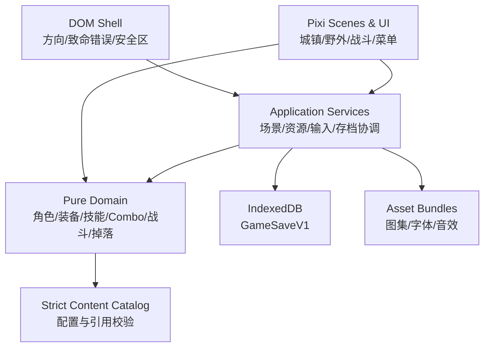
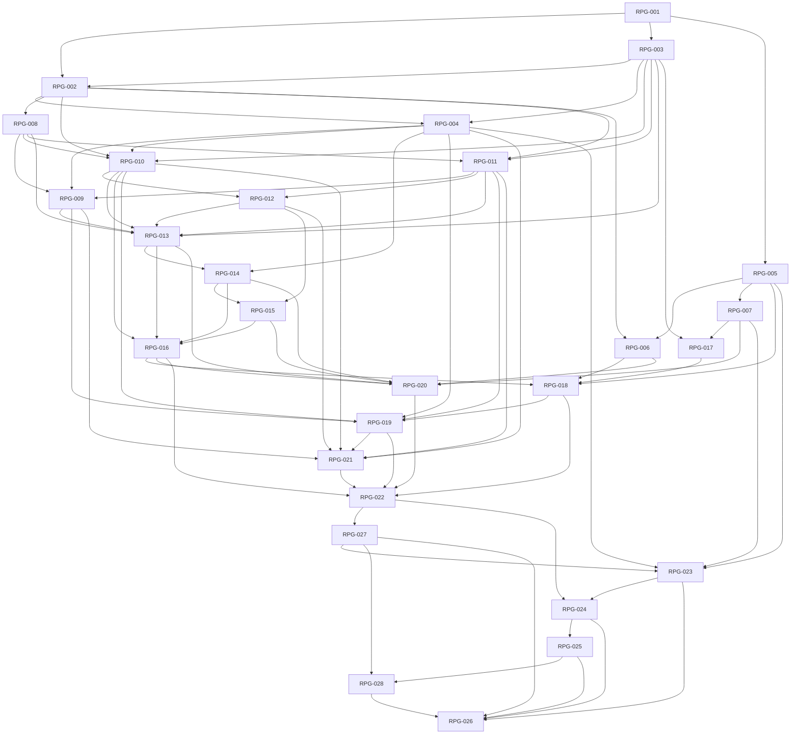

# 技术方案

## 文档状态

- 版本：PLAN-1.3
- 需求版本：REQ-1.3 CONFIRMED
- 架构评审：PASS（P0=0/P1=0；P2 均有实施归属）
- 实施批准：是（用户 2026-08-20 选择 AUTO；决策 LOCAL_SUBAGENT）
- 目标目录：`/Users/lcc/temp/xiangsu`

## 当前架构

- 当前无应用代码、`package.json`、构建脚本、测试、素材或可运行基线。
- 最近 Git 根在父目录且未提交，不能把父目录其他项目当成本项目依赖。
- 所有技术文件与资源从零创建；不承担历史兼容。

## Superpowers 能力路由

- 需求/玩法继续以 `business-requirement-agent` 的 DETAILED 包为唯一真源；新增判断先走 `superpowers:brainstorming`，不得在实现任务中临时做产品决策。
- 每张任务卡按 `superpowers:writing-plans` 的小步验收执行；明确代码任务交给 `implementation-coding-agent`，主 Agent 负责契约核对、集成和最终复核。
- 失败先走 `superpowers:systematic-debugging`，不边猜边改；任务完成前依次执行 `superpowers:requesting-code-review` 与 `superpowers:verification-before-completion`。
- 第一层纵切片、完整功能流程、分批内容和 680 场轻量数值回归是相互独立的门禁；真机性能数据仅用于发现明显问题，不阻塞自用功能版。

## Agent 编排

- 写入模式：SERIAL
- 写入说明：同一工作区串行写入；同一时间最多一个 `implementation-coding-agent` 修改文件，评审 Agent 只读。
- 共享契约：REQ/GAME/UI/DATA/LOC/ASSET 与六份冻结表、WORLD/PROFILE/EVAL-1.2 先冻结；实现 Agent 只能逐字段转录，不得补默认值或另造兼容字段。
- 文件所有权：每张任务卡列出的目标文件/模块由当张卡唯一写入 Agent 持有；跨卡公共契约由主 Agent 集成，评审意见回交原实现 Agent 修复。
- 状态真源：实现 Agent 只修改任务卡允许的生产/测试文件并回报结果，不修改任务卡、`progress.md` 或 `verification.md`；主 Agent 复核 diff 与原始命令输出后，唯一负责勾选完成记录和推进状态。
- 内容 CLI：`npm run verify:content -- --mode fixture` 仅供测试夹具；累计批次固定为 `--mode batch --batch verticalSlice|floors02_05|floors06_10|abyssEchoes`；候选构建固定 `--mode final`。无参数等同 final，内容尚未齐全时失败是预期行为，禁止借默认模式绕过阶段门禁。
- 工作区策略：RPG-001 及共享契约任务串行；依赖已完成、文件范围不重叠的任务允许多 Agent 并行，但每个写入 Agent 必须使用独立 worktree/工作副本并在 `progress.md` 登记所有权。当前仓库尚无首个提交且未授权 `git init`，所以在可验证隔离建立前仍串行，不以“允许并行”为由同目录并写。
- 用户已选择 `AUTO`，主 Agent 决策为 `LOCAL_SUBAGENT`：28 张卡各绑定一个计划内本地实现 Agent，同一时间只允许一个写入者，按依赖串行推进。

## 目标架构

### 1. 技术选型

| 领域 | 选型 | 理由 |
| --- | --- | --- |
| 语言 | TypeScript strict | 词条与战斗联合类型需要编译期约束 |
| 渲染 | PixiJS v8 | 用户指定；适合像素精灵、场景图、触控和移动 H5 |
| 构建 | Vite | Pixi 官方新项目推荐的通用 TypeScript 起点，开发反馈快 |
| UI | Pixi 场景 UI + 少量 DOM 系统层 | 游戏内保持统一像素风；方向/致命错误/无障碍状态由 DOM 保底 |
| 配置校验 | strict schema（计划使用 Zod，版本由 `package-lock.json` 锁定） | 启动和 CI 阻止缺字段、别名和无效引用 |
| 单测 | Vitest | 纯 TypeScript 领域测试和配置测试 |
| E2E | Playwright | 移动视口、触控、后台恢复和截图流程 |
| 持久化 | 原生 IndexedDB + repository | 无后端、无 localStorage 字段兼容，事务边界可控 |
| 包管理 | npm + lockfile | 当前环境已有 npm 命令授权，依赖版本由锁文件作为真源 |

不引入 React、Redux、ECS、物理引擎或通用 RPG 框架。当前规模用显式领域服务更容易验证，也减少移动端 bundle。

### 2. 分层



- `domain/**` 不得 import `pixi.js`、DOM 或 IndexedDB。
- 场景通过 command 调用领域层，只消费不可变结果/事件，不直接改存档对象。
- 内容目录启动后不可变；装备实例和存档只保存 ID 与 roll。
- UI 文案由 `nameKey`/`descriptionKey` 查本地化表，不作为业务规则。

### 3. 目录

```text
src/
├── main.ts
├── styles.css
├── app/
│   ├── GameApp.ts
│   ├── ViewportService.ts
│   ├── SceneRouter.ts
│   ├── AssetService.ts
│   ├── AudioService.ts
│   ├── SaveCoordinator.ts
│   ├── BattleCommandGateway.ts
│   ├── EncounterTransitionService.ts
│   ├── GameStore.ts
│   └── input/
├── content/
│   ├── contracts.ts
│   ├── schemas.ts
│   ├── Catalog.ts
│   ├── locales/
│   │   └── zh-CN.ts
│   └── data/
├── domain/
│   ├── common/
│   ├── character/
│   ├── party/
│   ├── inventory/
│   ├── skill/
│   ├── combo/
│   ├── battle/
│   ├── exploration/
│   ├── reward/
│   ├── town/
│   └── save/
├── scenes/
│   ├── boot/
│   ├── title/
│   ├── exploration/
│   ├── town/
│   └── battle/
└── ui/
    ├── components/
    └── screens/
public/assets/
tests/
├── unit/
├── integration/
├── e2e/
└── visual/
scripts/
```

## PixiJS 运行时

### 1. Application

- 使用 `const app = new Application(); await app.init(options)`；初始化完成前不访问 renderer/canvas。
- 初始选项：`width:640`、`height:360`、`preference:'webgl'`、`antialias:false`、`backgroundAlpha:1`、`autoDensity:true`、`resolution:1`、`sharedTicker:false`、`autoStart:false`；不使用 `resizeTo:window`，逻辑 screen 始终为 640×360。
- ViewportService 只修改 canvas CSS width/height/left/top 做 contain，并将 CSS safe-area inset 换算到逻辑坐标；568×320 可使用小数 CSS scale，逻辑坐标/布局边界取整。HitAreaService 统一计算 `ceil(48/scale)`、`ceil(8/scale)` 与长按位移换算，并以浏览器 CSS 矩形实测为最终门禁。画质切换只调用 renderer.resize(640,360) 并更新 resolution，不改变领域坐标。
- 事件能力：`move: true`、`globalMove: true`、`click: true`、`wheel: false`。
- 注册 `CullerPlugin`；导入 `pixi.js/prepare`，转场完成前预上传新场景纹理。
- `resolution` 按画质档位使用 1/1/1.5；高画质是否保留 1.5 以实机数据为门禁。

### 2. 根场景图

```text
app.stage
├── sceneRoot            isRenderGroup=true
│   ├── mapBackRoot      不交互、可裁剪
│   ├── actorRoot        sortableChildren=true，zIndex=脚底Y
│   ├── mapFrontRoot     不交互、可裁剪
│   └── worldFxRoot      对象池
├── hudRoot              常驻场景 HUD
├── screenRoot           全屏管理页
├── modalRoot            弹窗
├── toastRoot            轻提示
└── transitionRoot       转场遮罩
```

- Sprite/Text/Graphics 等叶节点不挂 children；需要组合的角色、按钮用 Container 包裹。
- 静态地图按图集和对象类型排序以保持批处理。
- actor 只在坐标跨整数 Y 时更新 `zIndex`，不每帧无条件排序。
- 非交互地图树 `eventMode = 'none'`；UI 用 `static`，只有摇杆拖动开启 global move。

### 3. 更新循环

- ticker 提供真实 `deltaMS`，探索模拟用固定步 `1000/60ms`。
- 单帧累计 delta 最大 50ms，最多追赶 3 步；超过部分丢弃并记录性能采样。
- 省电档 ticker `maxFPS = 30`，每帧执行两个固定步，移动速度不变。
- 页面隐藏/竖屏时 `app.stop()` 并清空 accumulator；恢复后从 0 开始。
- 战斗规则不依赖 ticker；动画完成只决定何时显示下一个已结算事件。

## 权威状态与数据流

### 1. 真源

| 状态 | 权威所有者 | 持久化 |
| --- | --- | --- |
| 静态角色/技能/装备/地图 | `ContentCatalog` | 构建资源，带 `contentVersion` |
| 玩家长期进度 | `GameSaveV1` / `GameStore` | IndexedDB `slot_1` |
| 当前远征 | `ExpeditionSnapshotV1` | 稳定检查点 |
| 当前战斗规则状态 | `BattleSnapshotV1` | 每根行动后稳定检查点 |
| Pixi 节点、动画进度 | 当前 Scene | 不持久化 |
| 输入指针与摇杆 | `InputState` | 不持久化，暂停时清空 |
| Combo 激活集合 | `ComboMatcher` 派生 | 不持久化，读档重算 |
| 最终角色属性 | `StatCalculator` 派生 | 不持久化，读档重算 |

### 2. 写入流

```text
UI/Scene 产生 Command
  -> Domain Service 验证 revision 与业务前提
  -> 纯函数生成 NextState + DomainEvents
  -> SaveCoordinator 开 IndexedDB readwrite transaction
  -> 成功：revision +1，替换 GameStore，通知 ViewModel
  -> 失败：GameStore 保留旧真源或内存 pending，UI 显示明确错误
```

- 装备、交易、奖励提交是原子事务。
- 每个战斗根行动也经 SaveCoordinator 提交；BattleResolutionV1.consumedItem 只作为同事务扣除声明，不能在 InventoryState 与 BattleSnapshot 之间分两次保存。保存成功后才把 events 交给动画层。
- 探索移动使用内存运行态，地图转场/页面隐藏时才形成稳定快照。
- 宝箱使用通用 RewardService 在一次 revision 事务中同时提交资产、claimed ID 与 openedChestObjectIds；失败保持对象与资产原样，不在 Scene 里分步写入。
- 奖励使用 `rewardTransactionId` 幂等，不以按钮 disabled 代替领域幂等。
- 涉及存档的场景切换先完成资源加载与 detached prepare，再提交候选存档，最后 attach/enter；提交前失败保留旧场景，提交后发生不可恢复的 enter 异常时以已提交存档为真源重载，不做猜测式补偿回写。战斗根行动在保存成功前不改权威 Store、不播 events；位置检查点只保留一个可合并 pending snapshot；资产/交易/模式开始在 pending 时阻断新写命令。Repository 必须在 IndexedDB 同一 readwrite transaction 内读取实际 revision 做 CAS，多标签页 stale 只允许重载。

### 3. 随机流

- 使用 `xoshiro128**` 可序列化 4×uint32 RNG 状态，SplitMix32 展开种子；算法字节序、namespace FNV-1a 派生和测试向量由 `RPG-003` 固定。
- `expeditionSeed` 按 `game-design.md` 的精确 `encounter:<mapId>:<objectId>`、`battle:<mapId>:<objectId>`、`loot:<mapId>:<objectId>`、`chest:<mapId>:<objectId>` 与 `shop` namespace 派生子流；生产种子源封装 Web Crypto，测试注入固定 seed。
- 重铸不读取 expeditionSeed：对 `reforge:<itemKind>:<contentVersion>:<instanceId>:<lockedIndex>:<reforgeCount>` 的 UTF-8 字节做同一 FNV-1a 32，再初始化独立 RNG；预览与确认均重新派生并核对，不能通过刷新页面重抽。
- 战斗自身保存 `rngState`；重载后继续同一随机序列。探索怪物运行位置/RNG 不保存，重建时按 encounter namespace 与冻结锚点重启；玩家/安全位置、180 步保护和对象完成列表仍由 ExpeditionSnapshot 保存。
- 领域层的时间戳和实例/事务 ID 来自 `DomainContext` 注入；生产 IdFactory 固定输出 `<kind>_<uuid>`，kind 只能为 `eq|stone|exp|battle|root|event|reward`，uuid 为 `crypto.randomUUID()` 生成的小写 RFC 4122 v4 字符串。测试使用固定时钟与按 kind 单调序列；同一待提交候选/重试必须复用 ID，不得重新生成。领域代码不得自行读取环境随机源。
- 深渊回响开始时令 `attemptNumber=旧 echoAttemptSequence+1` 并与扣次数/建战斗原子保存；根流 `echo:<echoId>:attempt:<attemptNumber>` 再派生独立 `battle`/`loot` 子流。战斗行为不得影响掉落；开始失败不占编号，同一次终局重试复用编号、子流和奖励。

## 接口/数据/配置契约

- 精确字段：`data-contracts.md`。
- 战斗公式与阶段：`game-design.md`。
- UI 状态：`ui-spec.md`。
- 中文 key、错误模板与结构化详情：`localization-spec.md`；运行时只读取经校验的 `Record<string,string>`，不显示 raw key。
- 逻辑资源、帧/clip、动画、音频与 bundle：`asset-spec.md`；物理文件可以替换，逻辑 ID 不得猜测或回退。
- 全部技能、装备、词条、角色/敌人数值、经济、Combo 与世界内容只读取六份冻结表；平衡测试三档只读取 `balance-profile-spec.md`。实现任务只能逐行转录或按文档中的构建期纯函数展开，不得在 TypeScript 中另设策划默认值、战力倍率或测试专用智能 AI。
- 内容 schema 使用 strict mode；开发阶段按计划固定的 fixture/batch 模式执行对应集合的完整引用校验，候选构建和无参数 `npm run verify:content` 固定执行 final 全量校验。
- 内容数据先使用 TypeScript 常量并通过 `satisfies` + runtime schema 双重校验；不在首版引入运行时 Tiled 原始格式。
- 地图生产可后续增加 Tiled → `MapDefinition` 转换器，但运行时只接受 `MapDefinition`，不直接兼容多个 Tiled 版本。

## 资源策略

### Bundle 划分

| Bundle | 内容 | 驻留策略 |
| --- | --- | --- |
| `boot` | Logo、加载 UI、基础字体 | 全程驻留 |
| `core_ui` | 通用面板、装备/状态/Combo/物品图标 | 全程驻留 |
| `player_common` | 6 名角色的探索/战斗图集 | 新游戏或继续游戏后驻留，返回标题可卸载 |
| `town` | 城镇图集、NPC | 城镇驻留 |
| `battle_common` | 战斗 UI、通用特效 | 首次战斗后可驻留，内存门禁不通过则卸载 |
| `floor_01`…`floor_10` | 单层地图、敌人 | 当前远征驻留，回城卸载 |
| `abyss_common` | 6～10 层共用特效/敌人部件 | 进入深渊远征时驻留 |

- 进入战斗时保留当前 floor bundle，确保战后立即回图。
- 回城成功后再卸载 floor/abyss bundle；先从场景移除节点，再 `Assets.unloadBundle()`。
- 所有像素图集 `scaleMode: 'nearest'`，单边不超过 2048。
- manifest 使用 `asset-spec.md` 的 strict `AssetEntryV1` 与逻辑 AnimationDefinition；`npm run verify:assets` 检查精确 ID、尺寸、clip、bundle、双音频源和授权登记，候选构建不得使用缺图回退。
- 动态伤害数字、回合和冷却用 BitmapText；普通长描述只在值变化时更新 Text。
- 音频由 `AudioService` 使用原生 Web Audio API 管理 music/sfx 两个 GainNode，并暴露 strict `setMusic(musicId: MusicId | null, sceneMusicGainBps: number)`、`playSfx(sfxId: SfxId)`、`setUserVolume(channel: 'music' | 'sfx', value: number)`；sceneMusicGainBps 只接受 0～10000 整数，用户音量只接受 0～100 整数，越界/小数拒绝。`musicId=null` 以同一 200ms ramp 停止当前轨，只接受 ASSET-1.2 的 6 个 music/16 个 sfx ID。首次 pointerdown 后才 resume AudioContext。页面隐藏时 suspend，恢复时只在已有用户激活许可下 resume；未解锁音频不阻塞游戏，只显示静音状态。有效 gain、200ms BGM ramp/交叉淡化、事件调用点、去重和跳过规则只按 ASSET-1.2 4.4；用户值不因后台静音而被覆盖。

## 存档、兼容与恢复

- IndexedDB 数据库名：`affix_abyss_game`；object store：`save_slots`；key：`slot_1`。
- 首版 schemaVersion 1；迁移注册表初始仅接受 1。
- 不支持的版本复制原始 JSON 到内存导出入口（若浏览器允许下载），不覆盖原 store。
- `contentVersion` 不匹配时先执行明确内容迁移；不存在迁移则阻断。
- 页面 `visibilitychange` 只保存稳定状态；若根行动正在解析，先完整同步结算领域事件，再保存，不等待动画。
- `webglcontextlost` 时停止 ticker/输入/音频并显示恢复遮罩；context restored 后重建 renderer 资源和当前 bundle，再从 GameStore 重建 View，领域状态不变。第一次成功存档后仅请求一次持久存储权限，拒绝只告警。
- 发布新静态版本不删除旧 IndexedDB；回滚部署不执行数据回写。
- 继续游戏目的地只按精确状态决定：`battle.phase = REWARD_PENDING` 进入奖励页；其他非 COMPLETE battle 进入战斗；COMPLETE battle 先按 `outcome` 幂等完成返图/回城事务；无 battle 但有 expedition 进入对应地图；两者都无进入城镇。不得保存或猜测额外 `lastSceneName`。

## 基本可玩性和观测

- 开发构建提供可关闭的简化 HUD：FPS、场景节点数和当前 bundle；1% low、draw calls、heap 等高级采样可按明显问题再补，不作为首版前置。
- 领域错误、触发预算耗尽、存档失败、资源失败用结构化事件记录；单机首版仅存内存最近 200 条并支持复制，不上传服务器。
- 自用验证优先使用桌面 Chromium 的 568×320 移动视口和用户现有的一台移动设备；无真机时记录 NOT_RUN，但只要浏览器完整流程无崩溃即可继续内容任务。

## 任务依赖图



## 任务表

| ID | 目标 | 依赖 | 任务卡 | 验收 |
| --- | --- | --- | --- | --- |
| RPG-001 | 创建 Vite/TypeScript/Pixi 工程与真实质量命令 | 无 | `tasks/RPG-001.md` | AC-026, AC-029 |
| RPG-002 | 实现 strict 内容契约、Catalog、zh-CN 与内容校验 | RPG-001, RPG-003 | `tasks/RPG-002.md` | AC-026, AC-028, AC-035, AC-037, AC-038, AC-039, AC-040, AC-044, AC-045 |
| RPG-003 | 固定整数数学、可序列化 RNG 与领域结果 | RPG-001 | `tasks/RPG-003.md` | AC-010, AC-020, AC-033 |
| RPG-004 | 实现 GameSaveV1、IndexedDB 事务、远征模式/回响状态和稳定检查点 | RPG-002, RPG-003 | `tasks/RPG-004.md` | AC-024, AC-025, AC-032, AC-039, AC-042, AC-043, AC-045 |
| RPG-005 | 初始化 Pixi 应用、视口、安全区和生命周期 | RPG-001 | `tasks/RPG-005.md` | AC-001, AC-002, AC-025, AC-031 |
| RPG-006 | 实现场景路由、strict 资源/动画 Catalog、bundle 和失败恢复 | RPG-002, RPG-005 | `tasks/RPG-006.md` | AC-026, AC-029, AC-031, AC-035 |
| RPG-007 | 实现多指输入、动态摇杆和通用触摸按钮 | RPG-005 | `tasks/RPG-007.md` | AC-003, AC-025, AC-030 |
| RPG-008 | 实现角色属性、等级、经验、技能点和招募追赶初始化 | RPG-002 | `tasks/RPG-008.md` | AC-016, AC-017, AC-036 |
| RPG-009 | 实现招募追赶、四人阵型和编队约束 | RPG-004, RPG-008, RPG-011 | `tasks/RPG-009.md` | AC-006, AC-016, AC-024, AC-036 |
| RPG-010 | 实现背包、野外药水、装备生成、锻造特性与稳定候选重铸 | RPG-002, RPG-003, RPG-004, RPG-008 | `tasks/RPG-010.md` | AC-018, AC-019, AC-020, AC-035, AC-039 |
| RPG-011 | 实现技能装配、定向铭石生成和词条解析 | RPG-002, RPG-003, RPG-008 | `tasks/RPG-011.md` | AC-017, AC-033, AC-034, AC-035, AC-039 |
| RPG-012 | 实现 Combo 匹配、预览和触发预算守卫 | RPG-010, RPG-011 | `tasks/RPG-012.md` | AC-021, AC-022, AC-034, AC-035 |
| RPG-013 | 实现战斗状态、工厂、轮次与速度队列 | RPG-003, RPG-008, RPG-009, RPG-010, RPG-011, RPG-012 | `tasks/RPG-013.md` | AC-009, AC-010, AC-011, AC-024, AC-037, AC-038 |
| RPG-014 | 实现指令验证、精确目标、伤害、能量、冷却与根行动原子保存 | RPG-004, RPG-013 | `tasks/RPG-014.md` | AC-012, AC-015, AC-024, AC-037, AC-038 |
| RPG-015 | 实现状态、周期伤害、触发队列、Combo 运行时和快照门禁 | RPG-012, RPG-014 | `tasks/RPG-015.md` | AC-013, AC-022, AC-024, AC-034, AC-037, AC-038 |
| RPG-016 | 实现敌方 AI/意图/狂暴、遭遇修正、终局、掉落、奖励幂等和无渲染平衡框架 | RPG-010, RPG-013, RPG-014, RPG-015 | `tasks/RPG-016.md` | AC-014, AC-015, AC-020, AC-023, AC-035, AC-037, AC-038, AC-039, AC-040, AC-044 |
| RPG-017 | 实现探索移动、碰撞、相机和遭遇 AI | RPG-003, RPG-007 | `tasks/RPG-017.md` | AC-004, AC-008 |
| RPG-018 | 实现探索渲染、交互、遭遇/宝箱原子事务与 HUD | RPG-005, RPG-006, RPG-016, RPG-017 | `tasks/RPG-018.md` | AC-003, AC-005, AC-008, AC-024, AC-030 |
| RPG-019 | 实现标题、城镇、七类 NPC、商店/旅店/图鉴和多模式层数选择 | RPG-004, RPG-009, RPG-010, RPG-011, RPG-018 | `tasks/RPG-019.md` | AC-005, AC-006, AC-035, AC-039, AC-041, AC-042, AC-045 |
| RPG-020 | 实现两级指令、左右战场、意图/狂暴 HUD、目标选择、爽点动画与奖励页 | RPG-006, RPG-007, RPG-013, RPG-014, RPG-015, RPG-016 | `tasks/RPG-020.md` | AC-009, AC-012, AC-013, AC-030, AC-039, AC-040, AC-041, AC-043 |
| RPG-021 | 实现背包/铁匠、酒馆、技能/铭石定向、Combo、卡点诊断与设置页面 | RPG-004, RPG-009, RPG-010, RPG-011, RPG-012, RPG-019 | `tasks/RPG-021.md` | AC-017, AC-018, AC-019, AC-021, AC-030, AC-034, AC-036, AC-039 |
| RPG-022 | 集成城镇五功能 NPC、第一层纵切片、首个 Boss 意图，先跑 600 主门禁再跑 200 替代构筑 | RPG-016, RPG-018, RPG-019, RPG-020, RPG-021 | `tasks/RPG-022.md` | AC-027, AC-035, AC-037, AC-039, AC-040, AC-044 |
| RPG-023 | 完成恢复、错误、移动视口 E2E 与基本可玩性检查 | RPG-004, RPG-005, RPG-007, RPG-027 | `tasks/RPG-023.md` | AC-001, AC-002, AC-024, AC-025, AC-026, AC-029, AC-030, AC-031, AC-032, AC-041, AC-043 |
| RPG-024 | 扩展第 2～5 层普通区域、意图/修正并执行主档 240 + F3 替代 20 场 | RPG-022, RPG-023 | `tasks/RPG-024.md` | AC-007, AC-028, AC-035, AC-037, AC-039, AC-040, AC-044 |
| RPG-025 | 扩展第 6～10 层深渊、意图/修正、强力掉落并执行主档 300 + F6/F10 替代 40 场 | RPG-024 | `tasks/RPG-025.md` | AC-007, AC-023, AC-028, AC-035, AC-037, AC-038, AC-039, AC-040, AC-044 |
| RPG-026 | 完整功能回归、680 场轻量数值回归、构建审计和自用候选包 | RPG-023, RPG-024, RPG-025, RPG-027, RPG-028 | `tasks/RPG-026.md` | AC-001～AC-045 |
| RPG-027 | 实现短程刷取、未首通 Boss 重试和重复指令辅助 | RPG-022 | `tasks/RPG-027.md` | AC-041, AC-042, AC-043 |
| RPG-028 | 实现 10 个深渊回响的内容、直入战斗、次数、目标和增强奖励 | RPG-025, RPG-027 | `tasks/RPG-028.md` | AC-035, AC-045 |

## 需求追踪矩阵

| 需求/验收 | 任务 | 验证 |
| --- | --- | --- |
| R-001 / AC-001, AC-002 | RPG-005, RPG-023 | V-001, V-002, V-027 |
| R-002 / AC-003, AC-004, AC-005 | RPG-007, RPG-017, RPG-018 | V-003, V-004, V-005 |
| R-003 / AC-005, AC-006 | RPG-019, RPG-021 | V-005, V-006 |
| R-004 / AC-006, AC-007 | RPG-019, RPG-024, RPG-025, RPG-026 | V-006, V-007 |
| R-005 / AC-008 | RPG-017, RPG-018, RPG-022 | V-008 |
| R-006 / AC-016 | RPG-008, RPG-009, RPG-021 | V-016 |
| R-007 / AC-009, AC-010, AC-011 | RPG-013, RPG-020 | V-009, V-010, V-011 |
| R-008 / AC-012, AC-014, AC-015 | RPG-014, RPG-016, RPG-020 | V-012, V-014, V-015 |
| R-009 / AC-017 | RPG-008, RPG-011, RPG-021 | V-017 |
| R-010 / AC-018, AC-019 | RPG-010, RPG-021 | V-018, V-019 |
| R-011 / AC-020 | RPG-010, RPG-016 | V-020 |
| R-012 / AC-021, AC-022 | RPG-012, RPG-015, RPG-021 | V-021, V-022 |
| R-013 / AC-014, AC-023 | RPG-016, RPG-025 | V-014, V-023 |
| R-014 / AC-024, AC-032 | RPG-004, RPG-015, RPG-023 | V-024, V-032 |
| R-015 / AC-025, AC-026 | RPG-004, RPG-005, RPG-006, RPG-023 | V-025, V-026 |
| R-016 / AC-003, AC-030 | RPG-007, RPG-018, RPG-020, RPG-021, RPG-023 | V-003, V-030 |
| R-017 / AC-027, AC-028 | RPG-022, RPG-024, RPG-025, RPG-026 | V-027, V-028 |
| R-018 / AC-029, AC-031 | RPG-001, RPG-005, RPG-006, RPG-023, RPG-026 | V-029, V-031 |
| R-019 / AC-033, AC-034 | RPG-011, RPG-015, RPG-021 | V-033, V-034 |
| R-020 / AC-035 | RPG-002, RPG-006, RPG-010, RPG-011, RPG-012, RPG-016, RPG-019, RPG-022, RPG-024, RPG-025, RPG-028, RPG-026 | V-035 |
| R-021 / AC-036, AC-037, AC-038, AC-039 | RPG-008, RPG-009, RPG-010, RPG-011, RPG-014, RPG-015, RPG-016, RPG-020, RPG-021, RPG-022, RPG-024, RPG-025, RPG-026 | V-036, V-037, V-038, V-039 |
| R-022 / AC-040 | RPG-002, RPG-013, RPG-016, RPG-020, RPG-022, RPG-024, RPG-025, RPG-026 | V-040 |
| R-023 / AC-041, AC-042 | RPG-004, RPG-018, RPG-019, RPG-027, RPG-023, RPG-026 | V-041, V-042 |
| R-024 / AC-043 | RPG-004, RPG-014, RPG-020, RPG-027, RPG-023, RPG-026 | V-043 |
| R-025 / AC-044 | RPG-002, RPG-016, RPG-022, RPG-024, RPG-025, RPG-026 | V-044 |
| R-026 / AC-045 | RPG-002, RPG-004, RPG-016, RPG-019, RPG-020, RPG-028, RPG-026 | V-045 |

## 发布顺序

1. `RPG-001` 建立可重复的 install/build/test 环境并锁依赖。
2. `RPG-003` 先固定领域基础，随后 `RPG-002`、`RPG-004`～`RPG-021` 建立系统能力，不发布生产。
3. `RPG-022` 形成内部垂直切片。
4. `RPG-027` 先补齐短程、重试和辅助，再由 `RPG-023` 验证恢复、移动视口和完整可玩路径；不等待群体统计或双机性能数据。
5. `RPG-024`、`RPG-025` 分批录入 2～10 层并分别跑 260、340 场轻量回归；`RPG-028` 最后接入第十层后的深渊回响。
6. `RPG-026` 汇总 680 场并生成自用候选构建；实际部署仍需用户单独批准并指定托管目标。

## 回滚方案

- 代码回滚：部署保留上一份带内容版本号的静态构建；出现启动、存档或战斗 P0 时切回上一构建。
- 内容回滚：内容包与代码构建绑定 `contentVersion`，不能在相同 URL 静默替换；回滚必须同时回滚代码和内容引用。
- 存档：首版无破坏性迁移；新版本不得删除旧 store。旧构建无法读取新 schema 时应阻断，而非降级改写。
- 功能隔离：完整层数内容通过 `highestUnlockedFloor` 和内容版本控制；垂直切片阶段不会暴露未完成层。
- 当前不存在真实部署命令或平台，`RPG-026` 前不得编造回滚命令。

## 决策记录

| ID | 日期 | 决策 | 原因 |
| --- | --- | --- | --- |
| D-001 | 2026-08-12 | 移动端横屏、640×360 contain | 保持战斗左右构图和一致像素 UI |
| D-002 | 2026-08-12 | 单机 IndexedDB，无后端 | 用户未要求联网，先保障完整核心循环 |
| D-003 | 2026-08-12 | 纯领域规则与 Pixi 渲染分离 | 战斗/掉落需要确定性测试，10 层内容需复用 |
| D-004 | 2026-08-12 | 先第一层垂直切片再批量内容 | 降低十层内容在核心玩法未验证前的返工 |
| D-005 | 2026-08-12 | 技能铭石承载技能词条 | 参考《再刷一把》的技能强化维度，同时保持技能本体稳定 |
| D-006 | 2026-08-12 | 禁止隐藏词条优先级 | 参考机制中的覆盖关系不够可解释，本项目改为显式 stackRule/exclusiveGroup |
| D-007 | 2026-08-12 | 装备品质与锻造特性独立 | 保留低品质高价值掉落的判断空间，增强刷宝乐趣 |
| D-008 | 2026-08-12 | 地图运行时只接受自有 MapDefinition | 不把外部编辑器格式耦合进运行时兼容层 |
| D-009 | 2026-08-13 | 防御常数改为 300，并用层主狂暴制造可测门槛 | 避免后期高防同时造成刮痧和承伤过低，让落后/整备/突破三档可分离 |
| D-010 | 2026-08-13 | 每次远征第一枚精英铭石命中专注角色 | 六角色阶段完全随机调谐会形成过长脸黑尾部，定向入口保留词条随机但保证构筑方向 |
| D-011 | 2026-08-13 | 重铸改为最多三条稳定候选，确认后扣料 | 让刷取资源有明确选择价值，刷新页面不能绕过成本重抽 |
| D-012 | 2026-08-13 | 本地化 key 与逻辑资源 ID 独立冻结；占位物理文件可显式复用 | 系统开发不等待正式美术，同时防止缺 key/缺图在运行时被猜测式兜底掩盖 |
| D-013 | 2026-08-20 | 不做强制新手链/首个 Combo 保底 | 保留刷宝随机性；只用精英铭石必掉、调谐和重铸控制长尾 |
| D-014 | 2026-08-20 | 每个 Boss 一个高威胁意图，领域声明后隔一次合法行动释放 | 失败可读、手机上有反制窗口，控制只延后且狂暴仍优先 |
| D-015 | 2026-08-20 | 已清层短程、未首通 Boss 重试、普通/精英重复指令辅助 | 降低移动端重复点击与跑图成本，不让无跑图 Boss 复战成为最优农场 |
| D-016 | 2026-08-20 | 代表层双构筑门禁、8 个遭遇修正与 10 个固定深渊回响 | 降低唯一解和深层同质化，为主线后提供离线终局循环 |
| D-017 | 2026-08-20 | 第一层 600 场和实机纵切片通过后才批量录入后九层 | 提前暴露战斗节奏、UI 和数值问题，避免在 10 层内容上重复返工 |
